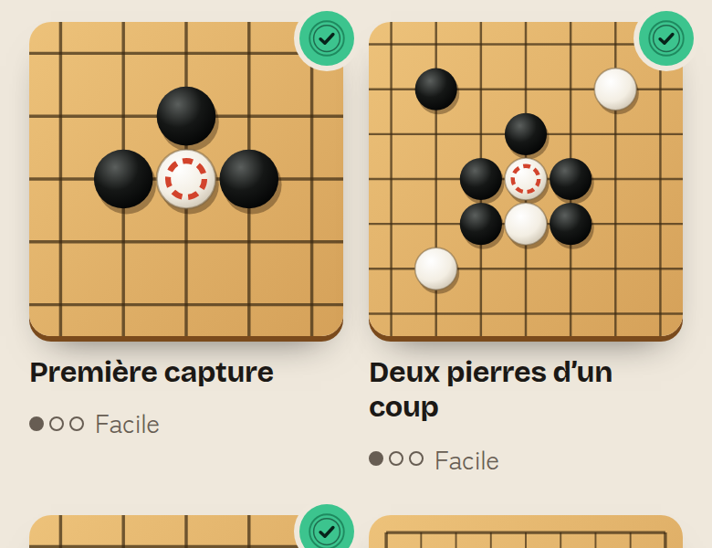
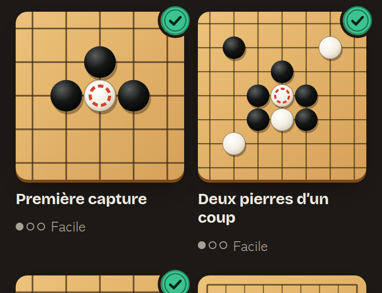

# Performance et fiabilité de la PWA, 29/09/2026

Issue #323, branche `perf-pwa-29`. Question posée : l'app s'ouvre-t-elle vite sur un téléphone moyen, et se rouvre-t-elle sans réseau ?

**Verdict.** Mesure finale sur une machine au calme : sur un téléphone lent en 4G lente, le bouton principal de l'accueil s'affiche en **3,1 s au lieu de 3,5 s** (−10 %, 5 passages très réguliers). Quand la machine est chargée, l'écart grandit : **3,2 s au lieu de 4,9 s**. Le JS initial passe de **306 à 254 Ko** gzip.

Surtout, **la réouverture sans réseau après une seule visite est maintenant garantie**. Avant, elle dépendait du hasard : 1 fois sur 5 sur la machine chargée, 5 sur 5 au calme. Maintenant, c'est 5 sur 5 dans les deux cas, avec tous les écrans, et un test e2e la vérifie. Le rendu ne change pas : la feuille CSS produite est identique octet pour octet (même empreinte `index-XgA2HSif.css`).

## Méthode

- Build de production (`npm run build`), servi par `scripts/mesurer-perf.mjs`. Ce petit serveur local compresse en gzip et répond comme Vercel sans `vercel.json` : `Cache-Control: public, max-age=0, must-revalidate` et `ETag`.
- Chromium de `/opt/pw-browsers`, 390 × 844, tactile, `fr-FR`. **CPU 4× plus lent** et réseau **« 4G lente » de DevTools** (latence 562,5 ms, 1,44 Mbit/s descendant, 675 kbit/s montant), par le protocole DevTools.
- Consentement déjà refusé (`go.consentement.v1 = refuse`) : on mesure l'accueil, pas la fenêtre de consentement. PostHog et Sentry ne sont pas configurés dans ce build local (pas de clé) : voir la limite 3.
- Trois temps par passage, dans un contexte neuf :
  1. **première visite** (aucun cache) ;
  2. **réouverture hors ligne** : service worker installé, 3 s d'attente, puis réseau coupé et page rechargée ;
  3. **retour** avec réseau (cache HTTP et service worker).
- « Bouton principal » : premier instant où `main.app-home .cta` est affiché. « Polices » : premier instant où Bricolage Grotesque 700 et Zen Kaku Gothic New 400 sont prêtes, c'est-à-dire la fin du texte de repli.
- La machine est partagée avec d'autres agents. Les builds sont donc mesurés **en alternance** (avant, après, avant, après…), 5 passages chacun : la charge pèse autant sur chacun. On donne la médiane et les 5 valeurs. Deux séries : une sur la machine chargée (vers 23 h 30, pour choisir entre les variantes), une finale sur la machine au calme (vers 0 h 45, la référence).

Relancer : `npm run build && npm run perf -- --runs 5` (option `--dist a,b` pour comparer deux builds copiés à part).

## Avant (origin/main à `0db4c7c`)

### Tailles

| Fichier | Brut | gzip | Chargé |
|---|---:|---:|---|
| `index-*.js` (tout : React, Supabase, les 11 écrans, contenus FR et EN) | 1 074 Ko | **306 Ko** | au démarrage |
| `index-*.css` | 112 Ko | 22 Ko | au démarrage |
| 4 polices woff2 (latin seul, déjà compressées) | 70 Ko | — | au premier rendu |
| `module-*.js` (PostHog) | 305 Ko | 100 Ko | à la demande, selon le consentement |
| `index-*.js` (Sentry) | 442 Ko | 149 Ko | à la demande, avec accord |
| `simple.worker-*.js` (moteur des adversaires) | 100 Ko | 34 Ko | à la première partie |
| KataGo : `worker-*.js`, `shared-*.js`, `index-*.js` (TensorFlow.js) | 1 382 Ko | ≈ 352 Ko | à la première analyse |

Le réseau KataGo (`*.bin.gz`) est chargé à part par le moteur : il n'était pas, et n'est toujours pas, dans le bundle. Images : l'app dessine tout en SVG dans le code. Seuls `icon-192.png` (17 Ko), `icon-512.png` (88 Ko) et `apercu.png` (231 Ko, aperçu Open Graph, jamais chargé par l'app) sont des fichiers image.

### Constats

1. **Un seul fichier JS pour tout.** L'accueil attendait le code de la partie, de la revue, des leçons, des problèmes, de la course, du profil, de l'import SGF et du placement.
2. **Hors ligne au hasard.** À l'installation, le service worker ne mettait en cache que `/`, le manifeste et les icônes. Le JS, le CSS et les polices de la première visite passent avant qu'il contrôle la page : ils n'entraient pas dans son cache. Réouvrir l'app sans réseau dépendait donc du minutage. Machine chargée : **1 sur 5**, écran vide les 4 autres fois. Machine au calme : 5 sur 5.
3. **Cache jamais renouvelé.** `go-shell-v1` ne changeait pas de nom : chaque version déployée y ajoutait ses fichiers, sans rien effacer.
4. **Pas de budget de taille** : rien n'empêchait un écran lourd, ou TensorFlow.js, d'entrer dans le JS initial.
5. Sans `vercel.json`, Vercel sert `/assets/*` avec `max-age=0` : chaque fichier à empreinte est revalidé (un aller-retour à 562 ms en 4G lente) quand il ne vient pas du service worker.
6. Hors périmètre, signalé : une déclaration CSS orpheline dans `src/ui/apprendre.css` fait sauter la règle `.pastille-ok` (avertissement du build) → **#324**.

## Corrections

| Changement | Fichiers |
|---|---|
| **Écrans à la demande** : Partie (avec la Revue), Leçons, Problèmes (avec la Course), Série de pratique, Profil (avec Compte et import SGF), Placement. `React.lazy` et un `Suspense` autour de l'écran. L'accueil, la fenêtre de consentement et la barre de navigation restent dans le JS initial. | `src/app/ecrans.ts` (nouveau), `src/app/App.tsx` |
| **Rendu identique** : les CSS de ces écrans sont importées par `main.tsx`, avant `App` et dans l'ordre d'origine. Elles restent dans la feuille principale, à la même place : même fichier CSS, même empreinte. | `src/main.tsx` |
| **Préchargement** : le code de la partie (action principale de l'accueil, ≈ 20 Ko gzip) part dès l'ouverture. Pour le reste, une fois la page chargée et les polices prêtes, quand le navigateur est libre, les écrans se téléchargent en tâche de fond, puis le service worker s'enregistre. Avant, il s'enregistrait au `load` et se disputait la bande passante avec les polices. | `src/app/ecrans.ts`, `src/main.tsx`, `src/registerSW.ts` |
| **Morceau introuvable** (nouvelle version déployée pendant que l'app était ouverte) : 3 nouveaux essais espacés, puis un rechargement de la page, au plus une fois par minute. Même chose pour `vite:preloadError`. | `src/app/ecrans.ts`, `src/main.tsx` |
| **Service worker** : la liste des fichiers est injectée au build dans `dist/sw.js` (JS initial, écrans, CSS, polices, moteur simple). Il y a une version par build : l'ancien cache est effacé à l'activation. Un fichier à empreinte déjà en cache est recopié, pas retéléchargé. KataGo, TensorFlow.js, PostHog et Sentry vont dans un cache d'exécution limité à 40 entrées, gardé d'une version à l'autre. Recherche en cache avec `ignoreVary` : le serveur répond `Vary: Origin` (constaté avec `vite preview`), et la copie mise en cache à l'installation, demandée sans `Origin`, n'était jamais retrouvée pour les scripts `crossorigin` (écran vide hors ligne, trouvé par le test e2e). La navigation reste « réseau d'abord ». | `public/sw.js`, `outils/pwa.ts` (plugin Vite), `vite.config.ts` |
| **Bibliothèques à part** : `lib-react-*.js` (React, ReactDOM) et `lib-donnees-*.js` (Supabase), préchargés par `modulepreload`. Leur empreinte ne bouge pas quand le code de l'app change : après un déploiement, le service worker ne retélécharge que le code de l'app. | `vite.config.ts` |
| **Budget en CI** : `npm run budget` échoue si le JS initial dépasse 275 Ko gzip, le CSS initial 30 Ko, les polices 80 Ko, un écran 60 Ko, ou s'il n'y a plus d'écran chargé à la demande. | `scripts/budget-bundle.mjs`, `.github/workflows/ci.yml`, `package.json` |
| **Cache HTTP de Vercel** (à valider, voir plus bas) : `/assets/*` en `max-age=31536000, immutable`, `/sw.js` toujours revalidé. | `vercel.json` (nouveau) |
| **Mesure reproductible** : `npm run perf`. | `scripts/mesurer-perf.mjs` |

Non retenu :

- **Navigation « cache d'abord »** : le retour serait plus rapide, mais le joueur verrait l'ancienne version jusqu'à la visite suivante. Or le serveur (fonctions Supabase) évolue avec le client. À décider avec une invite « nouvelle version ».
- **Précharger les polices** dans `index.html` : elles passeraient avant le JS, et le bouton principal arriverait plus tard. Avec `font-display: swap`, le texte est lisible tout de suite.
- **Séparer le CSS par écran** : environ 8 Ko de gagnés, mais l'ordre de la cascade changerait. C'est un risque sur le rendu, pour un petit gain.

## Après

### Tailles (JS initial, gzip, `npm run budget`)

| Fichier | gzip |
|---|---:|
| `index-*.js` (accueil, App, contenus, règles) | 129,5 Ko |
| `lib-react-*.js` | 67,3 Ko |
| `lib-donnees-*.js` (Supabase) | 57,1 Ko |
| **Total JS initial** | **253,9 Ko** (306,4 avant, −17 %) |
| CSS initial | 21,8 Ko (identique) |
| Polices | 68,7 Ko (identique) |

Écrans à la demande (gzip) : Problèmes 12,7 Ko, Revue 10,6 Ko, Partie 10,3 Ko, Profil 8,8 Ko, Leçons 6,4 Ko, Placement 1,4 Ko, Série 0,7 Ko, et quelques petits morceaux partagés (erreurs, lecteur, confettis).

### Temps, mesure finale (machine au calme, 5 passages alternés, CPU 4×, 4G lente)

Build final de la branche (après fusion d'`origin/main` à `15f3bca`) contre l'avant (`0db4c7c`).

| | Avant | **Après** |
|---|---:|---:|
| Première visite, bouton principal | 3 471 ms | **3 120 ms** (−351 ms) |
| — les 5 passages | 3471, 3473, 3463, 3437, 3480 | 3123, 3166, 3072, 3112, 3120 |
| Première visite, FCP (= LCP) | 3 524 ms | **3 172 ms** |
| Première visite, polices prêtes | 4 465 ms | 4 419 ms |
| Retour, bouton principal | 343 ms | 290 ms |
| Réouverture hors ligne | 5 / 5 | 5 / 5 |
| Hors ligne, bouton principal | 280 ms | 331 ms |

### Temps, variantes (machine chargée, 5 passages alternés)

| | Avant | v1 : écrans à la demande et SW | **v2 : v1 + préchargement après les polices (retenu)** | v3 : v2 sans bibliothèques à part |
|---|---:|---:|---:|---:|
| Première visite, bouton principal | 4 867 ms | 3 530 ms | **3 239 ms** | 3 428 ms |
| — les 5 passages | 4954, 3591, 4867, 5754, 3764 | 4382, 3286, 3588, 3377, 3530 | 3966, 5905, 3189, 3239, 3233 | 3351, 3311, 3889, 3428, 4175 |
| Première visite, FCP (= LCP) | 4 920 ms | 3 620 ms | **3 312 ms** | 3 620 ms |
| Première visite, polices prêtes | 6 162 ms | 4 367 ms | **4 297 ms** | 4 760 ms |
| Retour, bouton principal | 535 ms | 380 ms | 474 ms | 822 ms |
| **Réouverture hors ligne** | **1 / 5** | 5 / 5 | **5 / 5** | 5 / 5 |
| Hors ligne, bouton principal | 1 678 ms (1 seul) | 935 ms | 721 ms | 720 ms |

Le build final ajoute à v2 : `ignoreVary` dans le service worker, et le code de la partie préchargé dès l'ouverture.

Lecture :

- Le premier affichage (FCP) est l'accueil complet : l'app ne montre rien avant que React ait rendu. Le JS initial reste donc le levier principal.
- Le JS transféré à la première visite (320 Ko après, 306 avant) contient les écrans préchargés après l'affichage. Ils ne retardent pas le premier écran.
- Les polices arrivent au même moment qu'avant sur la machine au calme, et plus tôt sur la machine chargée. En v1, le service worker s'enregistrait au `load` et les retardait : d'où le préchargement après les polices.
- Retour et hors ligne : les écarts de 50 ms restent dans le bruit. Sur la machine chargée, v3 est plus lent : sans bibliothèques à part, le service worker sert un seul gros fichier.
- En production, le cache HTTP `immutable` (`vercel.json`) évite en plus les revalidations des fichiers `/assets/*`. C'est utile quand le service worker n'est pas encore actif. La mesure locale ne le montre pas.

## Tests

- Vitest : `outils/pwa.test.ts` (liste de fichiers du service worker, injection, version) et `src/app/ecrans.test.ts` (aucun import direct d'écran dans App, même clé des problèmes résolus que `Puzzles.tsx`, CSS des écrans dans `main.tsx`, nouveaux essais, rechargement unique).
- Playwright : `e2e/hors-ligne.spec.ts`. Après une visite, réseau coupé : l'accueil se rouvre, puis Apprendre, Problèmes, Profil et une partie à deux s'ouvrent. Suite e2e complète : 271 réussis, 2 échecs `accueil-une-action` (plateau décalé de 1,6 px). Ils échouaient de la même façon sur `origin/main` et passent depuis #330, fusionné dans la branche (parcours clés relancés : 25 sur 25).
- CI : `npm run budget` après `npm run build`.

## Limites et suites

1. **À valider par Florian : `vercel.json` est nouveau.** Il ne touche ni au build ni aux redirections, seulement aux en-têtes de cache. Pour y renoncer : supprimer le fichier, le reste de la branche n'en dépend pas.
2. Un écran qui ne se charge pas du tout (hors ligne sans cache, après 3 essais et un rechargement) n'a pas encore d'écran d'erreur. Il faudrait une limite d'erreur React avec « Réessayer » : c'est du texte d'interface, à faire par l'agent frontend.
3. **#325**, gains suivants : textes anglais et PostHog, **faits le 30/09** (section suivante). Supabase au démarrage : laissé, voir plus bas.
4. **#324** : règle CSS `.pastille-ok` ignorée, **corrigée le 30/09** (section suivante).
5. Réseau KataGo : non mesuré ici (chargé à part par le moteur, à la première analyse).

## Suite du 30/09 : #325 et #324

Branche `perf-325`, partie d'`origin/main` à `2428248`. Entre-temps, le JS initial était remonté à **269 Ko** (leçons 9 à 12, série du jour…).

**Verdict.** Un joueur en français ne télécharge plus les textes anglais : le JS initial passe de **269,1 à 230,2 Ko** gzip (−39 Ko, −14 %) et le bouton principal de l'accueil arrive en **3,0 s au lieu de 3,5 s** (téléphone lent, 4G lente). Un joueur en anglais y gagne aussi (**3,26 s au lieu de 3,46 s**). Le budget du JS initial passe de 275 à **250 Ko**. Rendu inchangé, sauf les miniatures réussies des problèmes (#324), qui prennent enfin le style prévu par #103.

### Ce qui change

| Changement | Fichiers |
|---|---|
| **Textes anglais à la demande** : interface (`i18n/en.ts`), leçons (`content/lessons.en.js`) et problèmes (`problemes.en.ts`) sont réunis dans un seul morceau, `anglaisContenu-*.js` (39,5 Ko gzip). `src/content/anglais.ts` le charge par `import()` avec un `await` au niveau du module, seulement si la langue choisie est l'anglais. Les modules qui en dépendent (i18n, leçons, problèmes) ne s'évaluent qu'après : ils lisent l'anglais dès leur premier calcul, comme avant. Changer de langue dans le Profil recharge déjà la page : rien ne change. | `src/content/anglais.ts`, `src/content/anglaisContenu.ts`, `src/content/i18n/detection.ts` (détection sortie d'`index.ts`, réexportée), `src/content/i18n/index.ts`, `src/content/lessons.ts`, `src/content/problemesLangue.ts` |
| **Morceau anglais introuvable** (réseau coupé à ce moment-là) : l'app s'ouvre en français au lieu d'un écran vide (`langueAuChargement`). | `src/content/anglais.ts` |
| **Préchargement pour un joueur en anglais** : sans lui, le morceau anglais n'était demandé qu'après le JS d'entrée, soit un aller-retour de plus (**3,84 s au lieu de 3,46 s** mesurés). Un plugin Vite ajoute dans `<head>` un petit script qui reprend la détection de la langue et, si c'est l'anglais, lance un `modulepreload` du morceau en même temps que le JS d'entrée. Il ne décide rien : s'il se trompait, on perdrait l'avance, rien de plus. Un test Vitest le compare à `detecterLangue` sur 17 cas. | `outils/prechargerAnglais.ts`, `vite.config.ts` |
| **Workers du moteur** : `simple.worker-*.js` passe de 100 à 68 Ko (brut) : il embarquait le catalogue anglais sans s'en servir. Hors du fil principal, l'anglais n'est jamais chargé. | (effet du découpage) |
| **PostHog après le premier écran** : au niveau anonyme (pas de réponse à la fenêtre de consentement), `import('posthog-js')` attend que l'accueil soit affiché, ses polices prêtes et le navigateur libre (`src/premierEcran.ts`, le moment déjà utilisé pour les écrans et le service worker). Les événements gardent leur heure d'origine (`timestamp`). Avec accord (« complet »), chargement immédiat comme avant. Si le joueur s'oppose pendant l'attente, PostHog n'est jamais chargé. Compatible avec `docs/juridique/consentement.md` : mêmes réglages (`POSTHOG_ANONYME`, stockage en mémoire), seulement plus tard. | `src/premierEcran.ts` (nouveau), `src/app/ecrans.ts` (réexporte `apresPremierEcran`), `src/data/analytics.ts` |
| **#324** : la fin orpheline de la règle `.montagne` (retirée avec la montagne par #138) faisait ignorer `.pastille-ok`. Supprimée. Le build n'affiche plus d'avertissement CSS, et un test Vitest passe chaque feuille de `src/` au minifieur : aucun avertissement accepté. | `src/ui/apprendre.css`, `src/ui/css-syntaxe.test.ts` |
| Budget du JS initial : 275 → **250 Ko** gzip. | `scripts/budget-bundle.mjs` |

**Supabase au démarrage (57 Ko) : laissé, pas sûr aujourd'hui.** `App.tsx` lit la session (`useSession`) dès l'accueil, et le client est un objet synchrone passé à 7 hooks et 4 écrans (`supabase` ou `null`). Le rendre asynchrone touche `App.tsx`, `Account.tsx` et les écrans du défi, que l'agent de #343 réécrit en ce moment. Surtout, avec la décision du 30/09 (compte obligatoire, essai limité sans compte), l'accueil devra savoir tout de suite si le joueur est connecté : Supabase redevient utile au premier écran. À reprendre après #343, par exemple en lisant la session du stockage local sans le SDK.

### Tailles (JS initial, gzip, `npm run budget`)

| Fichier | Avant (`2428248`) | Après |
|---|---:|---:|
| `index-*.js` | 144,7 Ko | **105,8 Ko** |
| `lib-react-*.js` | 67,3 Ko | 67,3 Ko |
| `lib-donnees-*.js` (Supabase) | 57,1 Ko | 57,1 Ko |
| **Total JS initial** | 269,1 Ko | **230,2 Ko** (−14 %) |
| `anglaisContenu-*.js` (à la demande, joueurs en anglais) | — | 39,5 Ko |

### Temps (CPU 4×, 4G lente, 3 passages par build, médiane)

Même méthode que le 29/09, avec `npm run perf -- --dist avant,après`. Machine partagée : builds mesurés l'un après l'autre, pas en alternance. Écarts de moins de 100 ms à lire comme du bruit.

| Joueur | | Avant | **Après** |
|---|---|---:|---:|
| **Français**, consentement refusé | bouton principal | 3 505 ms (3556, 3505, 3364) | **3 040 ms** (3067, 2931, 3040) |
| | FCP (= LCP) | 3 540 ms | 3 076 ms |
| | polices prêtes | 4 508 ms | 4 371 ms |
| | retour, bouton principal | 350 ms | 279 ms |
| | hors ligne | 3 / 3, 316 ms | 3 / 3, 310 ms |
| **Anglais** (`en-US`), consentement refusé | bouton principal | 3 459 ms (3459, 3429, 3523) | **3 259 ms** (3259, 3268, 3188) |
| | — sans le préchargement | | 3 843 ms (3843, 3758, 3854) |
| **Français, sans réponse au consentement**, build avec une clé PostHog factice (envois vers le serveur local) | bouton principal | 3 030 ms (3030, 2992, 3046) | 2 962 ms (2955, 3020, 2962) |
| | polices prêtes | 4 539 ms | 4 328 ms |
| | JS transféré pendant la mesure | 406,8 Ko | 306,9 Ko |

Lecture :

- Le gain principal vient des textes anglais : 39 Ko de moins à télécharger **et** à analyser avant le premier rendu.
- PostHog différé ne change presque pas l'arrivée du bouton (dans le bruit) : il était déjà importé à part. Mais ses 100 Ko ne se disputent plus le réseau avec les polices (prêtes 200 ms plus tôt) ni le processeur pendant le premier rendu. Les mesures `npm run perf` (consentement refusé) ne chargent jamais PostHog : la ligne PostHog vient d'une variante locale du script (locale et consentement modifiables), non gardée dans le dépôt.
- Le JS transféré à la première visite reste d'environ 307 Ko pour un joueur en français : les écrans préchargés après l'accueil arrivent dans la fenêtre de mesure. Le morceau anglais, lui, n'est téléchargé que par le service worker, en tâche de fond.

### Captures #324 (miniatures réussies des problèmes, 390 px)

Avant, le sceau jade était rétréci dans un disque vert (`padding: 5px`, fond `--accent`) ; après, il occupe la pastille, sans fond, comme prévu par #103.

| | Avant | Après |
|---|---|---|
| Clair |  |  |
| Sombre |  |  |

### Tests ajoutés

- Vitest : `src/content/anglais.test.ts` (aucun module n'importe l'anglais directement, sauf `anglaisContenu.ts` ; mêmes textes une fois chargés), `outils/prechargerAnglais.test.ts` (même langue que `detecterLangue`, stockage bloqué), `src/data/analytics-premier-ecran.test.ts` (PostHog anonyme attend le premier écran, garde l'heure d'origine ; opposition pendant l'attente ; accord : immédiat), `src/ui/css-syntaxe.test.ts`. Les tests lisent l'anglais grâce à `src/content/anglais.setup.ts` (`setupFiles`).
- Playwright : `e2e/anglais-a-la-demande.spec.ts` (en français, l'accueil s'affiche sans le morceau anglais ; en anglais, il arrive avant le premier écran ; morceau bloqué : l'app s'ouvre en français, sans erreur). Trois specs qui calculent les textes anglais côté Node (`lecons-en`, `langue-parcours`, `lecons-16`) importent `anglais.setup.ts`.

### Reste à faire

- Écran d'erreur quand un écran chargé à la demande n'arrive pas (point 4 de #325) : pas fait ici, à confier à l'agent frontend (texte d'interface, `App.tsx`, en conflit avec #343 ce soir).
- Supabase hors du premier écran : après #343 (voir plus haut).

## Suite du 02/10 : #401, supabase-js hors du JS initial

Le JS initial était à 249,2 Ko pour un budget de 250 Ko : chaque nouvelle fonction butait sur la limite. Le plus gros morceau
dont l'accueil n'a pas besoin était supabase-js (`lib-donnees`, 57 Ko gzip), créé au chargement de `src/data/supabase.ts`.

### Ce qui change

- `src/data/client.ts` (léger, sans supabase-js) : `COMPTES` (comptes configurés, connu sans le client), `chargerSupabase()`,
  `useSupabase()` (`undefined` pendant le chargement, `null` sans comptes). `App`, `Game`, `Account` et `ProposerRappel` passent par lui.
- Quand : tout de suite si le premier écran en dépend (session de supabase-js sur l'appareil, jetons de connexion dans l'adresse,
  lien de défi #327/#338) ; sinon après le premier écran (`apresPremierEcran`, avec les autres écrans) ; ou plus tôt si une action le demande
  (défi, « Crée ton compte », Profil > Compte).
- Sans session enregistrée, `useSession` vaut `null` tout de suite : l'essai sans compte (#343) s'applique dès le premier écran,
  sans état « chargement » (qui laissait tout passer).
- Hors ligne : le morceau du client et `lib-donnees` restent dans le précache du service worker (`outils/pwa.ts`, import dynamique de code de `src/`).
- Erreurs au démarrage : une erreur non attrapée ou une promesse rejetée avant le chargement de Sentry passe par `captureError`,
  qui attend Sentry (avec accord seulement) ; le filet s'arrête quand Sentry est prêt (`ecouterErreursAvantSentry`, `src/data/analytics.ts`).
- Budget : JS initial à **200 Ko** (≈ 7 Ko de marge), et `lib-donnees` interdit dans le JS initial (`scripts/budget-bundle.mjs`).

### Tailles (JS initial, gzip, `npm run budget`)

| | Avant (`b98fc9b`) | Après |
|---|---|---|
| `index` | 124,8 Ko | 125,6 Ko |
| `lib-react` | 67,3 Ko | 67,3 Ko |
| `lib-donnees` (supabase-js) | 57,1 Ko | à la demande |
| **Total** | **249,2 Ko** | **193,0 Ko** |

### Temps (CPU 4×, 4G lente, `npm run perf`, médiane de 7, consentement refusé)

Builds de production avec une URL Supabase publique factice (le client est vraiment créé, comme en production).

| Parcours | Avant | Après |
|---|---|---|
| Première visite : bouton principal | 3 199 ms | **2 823 ms** (−376 ms) |
| Première visite : FCP | 3 244 ms | 2 880 ms |
| Première visite : polices prêtes | 4 555 ms | 4 228 ms |
| Première visite : JS transféré pendant la mesure | 335,0 Ko | 278,5 Ko |
| Retour (cache et service worker) | 408 ms | 336 ms (dans le bruit : 258 à 475 ms) |
| Hors ligne après une visite | 7/7 | 7/7 |

### Captures (accueil, premier lancement)

Fichiers identiques octet pour octet avant et après (390 × 844 et 320 × 568, clair et sombre) : rien ne change à l'écran.
`docs/design/captures/budget-js-marge/avant-*.jpg` et `apres-*.jpg`.

### Tests ajoutés

- Vitest : `src/data/client.test.ts` (aucun module n'importe `data/supabase` ni supabase-js en valeur ; seul `client.ts` le charge par
  `import()` ; PostHog, Sentry et TensorFlow.js jamais en statique ; politique de chargement de `main.tsx` ; `sessionProbable` ; essais
  et publication du client), filet du démarrage dans `src/data/analytics.test.ts`.
- Playwright : `e2e/chargement-supabase.spec.ts` (premier lancement : supabase-js téléchargé après l'évènement `load` ;
  lien de défi et session enregistrée : avant).

### Pistes suivantes (non faites)

- Catalogue des problèmes (`src/content/lots/*`, ≈ 30 Ko gzip dans `index`) : l'accueil n'en lit que le Go du jour (titre,
  miniature) et les thèmes de leçon. Un petit index du Go du jour suffirait au premier écran. Touche `App.tsx` et `goDuJour.ts`.
- Moteur simple (`src/engine/simple.ts`, `sim.ts`, `dead.ts`, ≈ 7 Ko) : tiré par `App.tsx` pour `OPPONENTS` et `niveauGuide`.
- `ConsentModal` (`Confidentialite.tsx`, 1,5 Ko) : seulement quand le choix n'est pas fait.
