# Les 10 premières minutes d'un nouveau joueur — 27 septembre 2026 (#154)

Auteur : agent `ux-jeux-mobiles`. Build : `origin/agent-ux-mobile` (= `main` à `b379f14` + la fiche de l'agent), `VITE_E2E=1 npm run build`, `vite preview` sur le port 4601. Chromium de `/opt/pw-browsers`, 390 × 844, `fr-FR`, écran tactile, stockage vide au départ (vrai premier lancement, consentement compris).

## Méthode et limites

- Parcours joué par script Playwright, 3 fois en sombre et 3 fois en clair. Captures de la dernière série dans `captures/` (`NN-moment-sombre.jpg` et `NN-moment-clair.jpg`).
- Le joueur scripté joue comme un débutant : il pose 16 pierres à des points « raisonnables », puis il passe. Il ne sait pas quand la partie est finie.
- Horloge simulée : premier lancement le 27/09 à 18 h 30, retour le 28/09 à 8 h 10, puis le 30/09.
- Grille d'évaluation de la fiche de l'agent : 3 secondes, premier plaisir, friction, sensation, envie de revenir, accessibilité.
- Limites : pas de vrai joueur, pas de VoiceOver. Pomme joue au hasard dans ses bons coups : chaque partie est différente. Les durées « humaines » sont des **hypothèses** (lecture à 200 mots par minute). Les données PostHog réelles n'ont pas été lues.

## Le parcours en un tableau

| # | Moment | Taps | Durée estimée | Émotion | Captures |
|---|---|---|---|---|---|
| 1 | Premier lancement : fenêtre « Tu m'aides à chasser les bugs ? » | 1 | 10 à 15 s de lecture | Méfiance (−) | `01` |
| 2 | Accueil : « Joue ta première partie » | 1 | 3 s | Curiosité (+) | `02` |
| 3 | Première pierre : touche → pierre fantôme → seconde touche | 2 | 5 s, plus si le fantôme surprend | Hésitation, puis plaisir (+) | `03` à `05` |
| 4 | Partie : 16 coups, puis Passer | ~35 | 3 à 4 min | Concentration | `06`, `07` |
| 5 | Comptage : « Je ne suis pas sûr pour certains groupes… » | 1 | 20 s | Confusion (−−) | `08`, `09` |
| 6 | Fin : Défaite (5 parties sur 6) ou Victoire | 1 | 10 s | Déception (−) ou fierté (++) | `10` |
| 7 | Retour à l'accueil | 1 | 3 s | Neutre | `11` |
| 8 | Leçon 1 : 3 écrans passifs, puis 2 questions | ~10 | 2 min | Compréhension (+) | `12` à `17` |
| 9 | Problèmes : invitation à se connecter, puis Go du jour | 3 | 1 min | Petit plaisir (+) | `18` à `21` |
| 10 | Lendemain : accueil identique, aucun rappel | – | – | Rien ne l'appelle | `23` à `25` |

Première pierre : 4 taps et environ 4 s en script, entre 15 et 25 s pour un humain (**hypothèse**). La cible de la charte (90 % dans la minute) semble tenable. Le vrai risque est ailleurs : **le comptage et le lendemain**.

Résultats des 6 parties scriptées : 5 défaites (de 0,5 à 5,5 points), 1 victoire de 0,5 point. Les 5 parties dont on a relevé le comptage ont toutes fini dans la phase manuelle (la 6e n’a pas été relevée).

---

## 1. Premier lancement

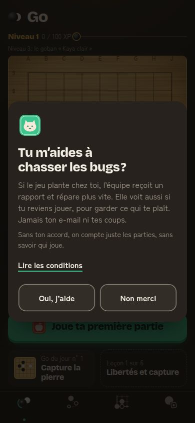 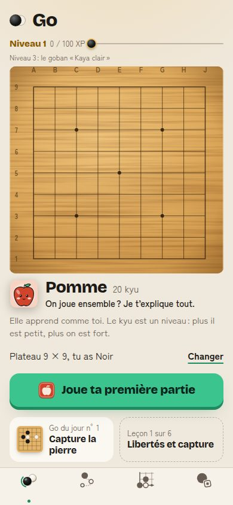

Ce qu'on voit : une fenêtre de consentement couvre l'accueil. Titre, 4 lignes de texte, un lien, deux boutons de même poids. Derrière, l'accueil est propre : **une seule action** (#119 est livré), Pomme se présente, le kyu est expliqué.

Comparaison :
- **Duolingo** : 1er écran « Commencer », puis quelques questions (langue, objectif), puis une leçon. Le compte est demandé **après** la première leçon. Duolingo rapporte un gain de rétention au lendemain d'environ 20 % grâce à ce report (sources 1, 2).
- **Lichess** : on arrive sur le site et on joue contre l'ordinateur, sans compte ni fenêtre (source 5).
- **chess.com** : la première question porte sur le jeu (« nouveau aux échecs ou expérimenté ? »), pas sur les données (source 6).

Constats :
- **C1. La première chose lue n'est pas le jeu** (UX-05 de l'audit, toujours ouvert). 60 mots à lire avant le plateau. Coût probable sur « première pierre dans la minute ».
- **C2. Les libellés de la barre du bas ont disparu.** Les 4 onglets ne montrent que des icônes : `Jouer`, `Apprendre`, `Problèmes`, `Profil` sont dans le DOM mais mesurent **0 px de large** (vérifié par script). Cause probable : `contain: inline-size` sur `.onglet-libelle` (`src/ui/nav.css`, #121). Le lecteur d'écran les lit encore. Un débutant ne peut pas deviner « Apprendre » derrière trois pierres en pointillé. NN/g : une icône de navigation a besoin d'un libellé (source 13).

## 2. Première partie contre Pomme

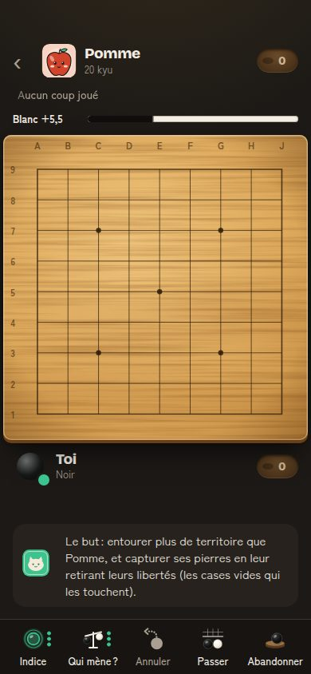 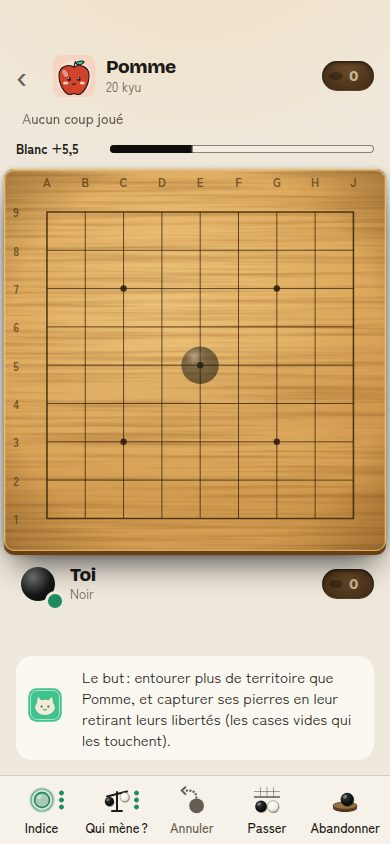 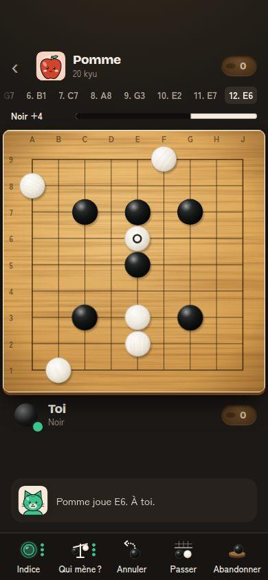

Ce qu'on voit : écran plein, plateau lisible, pas de barre du bas. Mochi explique le but. Pomme répond en moins d'une seconde. Bonne base.

Comparaison :
- **Clash Royale** : le premier combat se fait contre le Roi dans le camp d'entraînement. L'élixir monte plus vite, il n'y a pas de limite de temps, le Roi dit quelle carte poser. Le combat est conçu pour être gagné, puis un coffre s'ouvre. Il faut 3 combats pour quitter le camp (sources 7, 8).
- **Candy Crush** : les premiers niveaux se gagnent « presque par accident ». Une seule mécanique nouvelle à la fois, avec une flèche et une main animée (sources 9, 10).
- **BadukPop** : des adversaires IA « excentriques » de 20 kyu à 7 dan (source 11), comme notre échelle.

Constats :
- **C3. La barre d'avantage dit « Blanc +5,5 » avant le premier coup.** Le débutant démarre « perdant » sans savoir pourquoi. Le komi n'est expliqué qu'à la fin (« Sans le komi… tu gagnais ! »).
- **C4. La pierre fantôme arrive sans consigne.** Première touche : une pierre grise apparaît, et rien ne dit « touche encore ». Mochi parle toujours du but de la partie. C'est le tout premier geste du joueur.
- **C5. La première partie est souvent perdue** : 5 défaites sur 6 parties scriptées, dont 4 à moins de 6 points. Le komi de 6,5 suffit à faire perdre un débutant qui joue « normalement ». Clash Royale et Candy Crush garantissent la première victoire.

## 3. Fin de partie et score

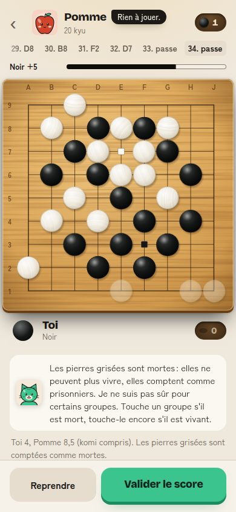 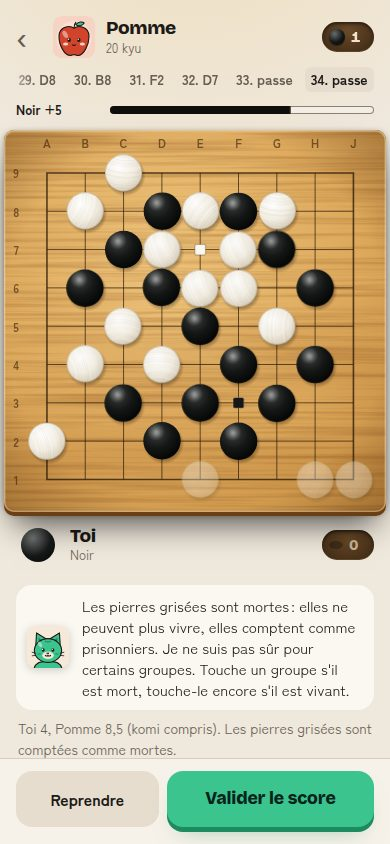 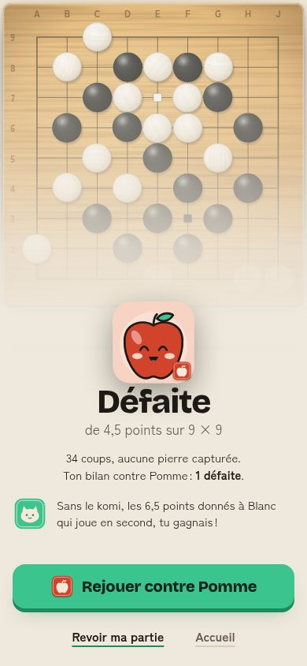 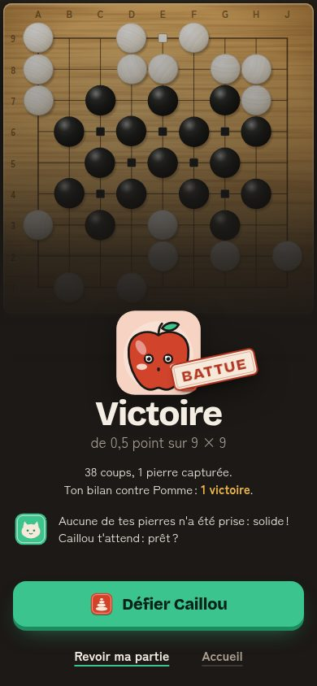

Ce qu'on voit : le joueur passe alors que plusieurs frontières sont ouvertes. Pomme dit « Je passe » ou « Rien à jouer ». Le comptage automatique (#117) n'est pas sûr, donc on bascule en phase manuelle : « Je ne suis pas sûr pour certains groupes. Touche un groupe s'il est mort, touche-le encore s'il est vivant. »

Constats :
- **C6. Dans 5 parties relevées sur 5, le débutant doit juger la vie et la mort.** C'est le creux UX-01 de l'audit : #117 le règle seulement quand la position est claire. Un débutant ne finit presque jamais ses frontières, donc ce cas est la règle, pas l'exception.
- **C7. La barre contredit le score.** Sur la capture claire : « Noir +5 » en haut, « Toi 4, Pomme 8,5 » en bas, puis « Défaite de 4,5 points ». Dans une autre partie : « Noir +22 », puis défaite de 2 points. L'estimation compte les frontières ouvertes, le comptage japonais non. Le joueur ne peut pas comprendre pourquoi il perd.
- **C8. Le conseil « passer au bon moment » ne joue pas dans l'autre sens.** Personne ne dit « Attends, il reste des frontières à fermer ». OGS a eu exactement ce problème : un long fil du forum sur le comptage qui perd les débutants. En 2024, OGS a ajouté un avertissement pour les points encore à fermer avant le comptage (sources 14, 15).
- **Bon point** : l'écran de fin est le meilleur moment du parcours. Sceau « BATTUE », portrait de Pomme surpris, « Aucune de tes pierres n'a été prise : solide ! ». Après une défaite, « Sans le komi, tu gagnais ! » console bien. C'est le « pic » de la règle pic-fin (source 16).

Comparaison :
- **chess.com** : la partie finit par un mat, un abandon ou le temps : jamais de comptage. La « Revue de partie » est plus généreuse avec les nouveaux joueurs : les « très bons coups » sont plus faciles à obtenir (source 17).
- **OGS** : un avertissement quand des points restent à fermer (source 15).

## 4. Retour à l'accueil

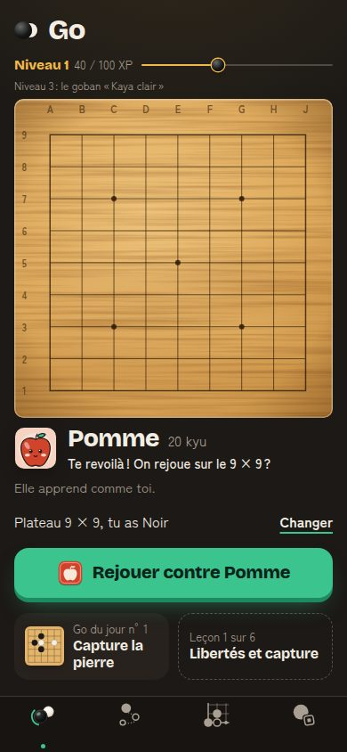

Ce qu'on voit : « Te revoilà ! On rejoue sur le 9 × 9 ? », bouton « Rejouer contre Pomme », barre d'XP à 15 / 100.

Constats :
- **C9. Après une victoire, l'accueil propose encore « Rejouer contre Pomme »**, même le lendemain. L'écran de fin disait « Caillou t'attend : prêt ? ». La promesse de l'échelle se perd dès qu'on quitte l'écran de fin.
- **C10. Les XP sont gagnés en silence.** Aucun écran de fin ne dit « +15 XP ». Après 10 minutes, le joueur a 65 XP (défaite) ou 90 XP (victoire) : **le niveau 2 n'arrive jamais pendant la première session**. Il manque 10 à 35 XP.

Comparaison :
- **Duolingo** : chaque leçon finit sur un écran « +XP », puis la série, puis la ligue. Le compteur bouge sous les yeux (source 2).
- **Clash Royale** : chaque victoire ouvre un coffre, et la barre du camp d'entraînement avance (source 8).

## 5. Première leçon

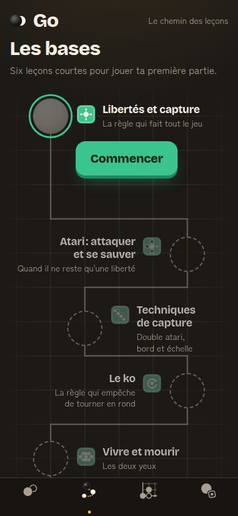 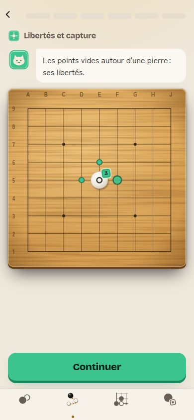 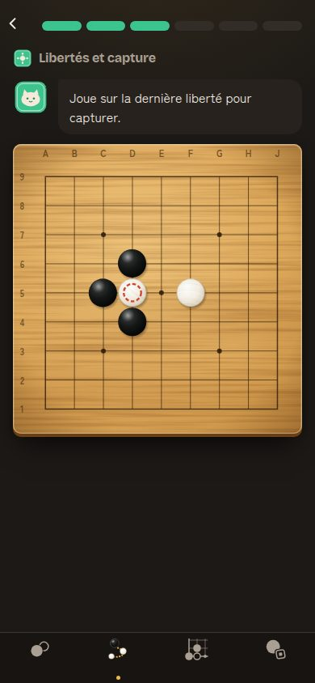 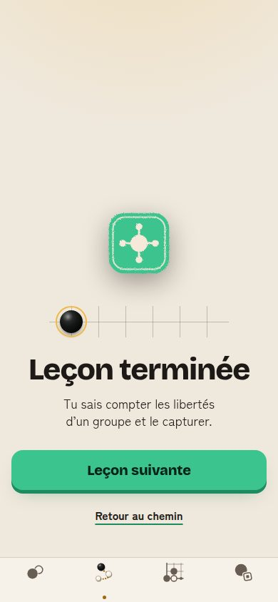

Ce qu'on voit : chemin clair, un bouton « Commencer ». Démonstrations animées, barre d'étapes, erreur bienveillante (« Cherche le seul point vide… »), fin de leçon sobre.

Constats :
- **C11. La barre du bas reste visible et les 3 premières étapes sont passives** (UX-06 et UX-08, toujours ouverts). 3 fois « Continuer » avant le premier geste.
- **C12. La fin de leçon ne mène nulle part ailleurs que la leçon suivante.** Pas de « +30 XP », pas de pont vers la pratique (« Essaie contre Pomme »).

Comparaison :
- **Duolingo** : leçon en plein écran, une croix pour sortir, barre de progression en haut. On répond dès le premier écran (source 2).
- **BadukPop** : « apprendre les règles en quelques minutes », leçons interactives pas à pas (source 11).
- **Candy Crush** : on apprend en jouant le niveau, pas en lisant (source 9).

## 6. Premier problème

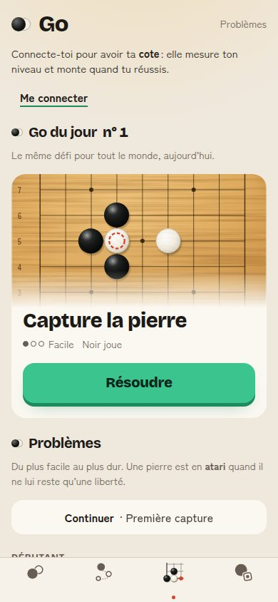 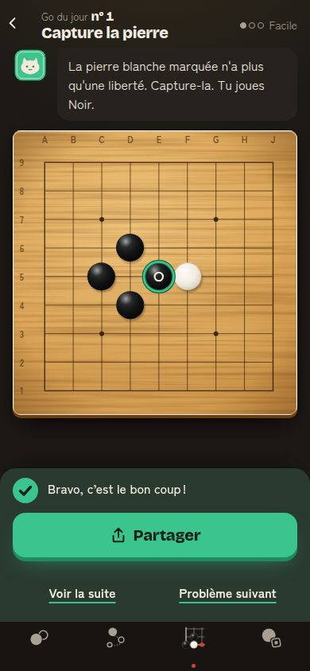

Ce qu'on voit : la première ligne dit « Connecte-toi pour avoir ta cote ». Puis le Go du jour, beau et clair, avec un seul bouton. Réussite : « Bravo, c'est le bon coup ! » et « Partager » en action principale.

Constats :
- **C13. Le Go du jour n° 1 est la même position que la question de la leçon 1** : pierre blanche en D5, capture en E5. Le joueur qui fait la leçon puis le problème résout deux fois le même exercice sans qu'on le lui dise.
- **C14. Le Go du jour n° 2 est « Moyen ».** Le lendemain, le débutant de la veille reçoit un problème plus dur, tiré du même calendrier que tout le monde.
- **C15. L'invitation à se connecter passe avant le défi** (UX-14, toujours ouvert).

Comparaison :
- **chess.com** : le problème du jour est le même pour tous. La série tient si on le résout dans les 48 h. On a 5 cœurs : une erreur coûte un cœur et le coach donne un conseil, **mais la série continue même sans cœur** (sources 18, 19).
- **BadukPop** : un mode classé ajuste la difficulté : réussir donne des problèmes plus durs, rater en donne de plus faciles (source 11).

## 7. Le lendemain

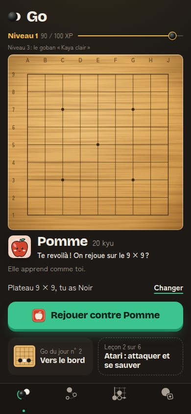 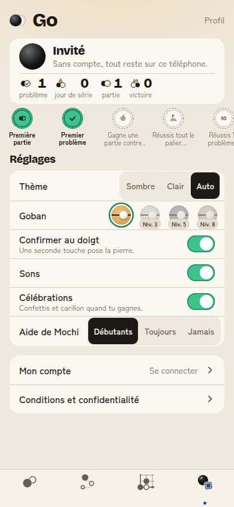

Ce qu'on voit : l'accueil du 28/09 est le même que la veille, à la carte du Go du jour près (n° 2). Même phrase de Pomme. Le Profil affiche « 0 jour de série » alors que le joueur a fait le Go du jour la veille : la série n'existe que pour un compte connecté (`useSerie` lit Supabase). Aucune notification, aucune invitation à installer l'app.

Constats :
- **C16. Un invité n'a pas de série.** Le ressort le plus fort de Duolingo et de chess.com est absent pendant les jours qui décident de J1 et de J7.
- **C17. Rien n'appelle le joueur.** Pas de rappel, pas de « nouveau défi », pas de raison écrite de revenir. Sur iPhone, une notification web n'est possible que si l'app est installée sur l'écran d'accueil (source 20). Or on ne propose jamais l'installation.

Comparaison :
- **Duolingo** : la série démarre dès la première leçon. Le « gel de série » réduit de 21 % l'abandon des joueurs sur le point de la perdre. Le « pari de série » a augmenté la rétention à J7 de 14 % (sources 3, 4). Les rappels sont choisis par un algorithme : +2 % de rétention des nouveaux joueurs (source 12).
- **chess.com** : problème du jour, série sur 48 h, cœurs non punitifs (sources 18, 19).

---

## Constats classés et propositions

Impact et effort de 1 à 5. Impact noté sur les indicateurs de `entreprise/charte.md`. Classement par rapport impact / effort. Chaque proposition nomme l'évènement PostHog qui la mesure (existant, ou à créer, en *italique*).

| # | Constat | Impact | Effort | Proposition concrète | Indicateur qui doit bouger |
|---|---|---|---|---|---|
| P1 | C2. Libellés de la barre du bas invisibles | 4 | 1 | Retirer `contain: inline-size` de `.onglet-libelle` (ou lui donner `width: 100%`). Test Playwright : chaque libellé fait plus de 20 px de large à 390 px et reste sans chevauchement à 195 px (#121). | Leçon 1 commencée depuis la barre (`lecon_terminee` / joueurs), note des stores |
| P2 | C1. Consentement en premier écran | 4 | 1 | Déjà priorité 2 de la feuille de route : fenêtre après la première partie ou la première leçon. Rien n'est envoyé avant l'accord. | `premiere_pierre` dans la minute (90 %) |
| P3 | C4. Fantôme sans consigne | 4 | 1 | La première fois seulement, Mochi dit : « Touche encore pour la poser. » Le fantôme pulse doucement (coupé en mouvements réduits). | Délai `app_ouverte` → `premiere_pierre` ; part des joueurs qui touchent 3 fois ou plus avant de poser (*`fantome_abandonne`*) |
| P4 | C10. XP invisibles, niveau 2 jamais atteint en 1re session | 3 | 1 | Afficher « +15 XP », « +30 XP » sur chaque écran de fin (partie, leçon, problème), avec la barre qui avance. Ajouter un bonus unique « première fois » (+40 XP) pour que le niveau 2 tombe dans la première session. | `niveau_atteint` pendant la 1re session ; J1 |
| P5 | C9. L'accueil oublie la victoire | 3 | 1 | Après une victoire, le bouton de l'accueil devient « Défier Caillou », comme l'écran de fin. | Parties contre Caillou / joueurs ayant battu Pomme ; `partie_terminee` par semaine (5) |
| P6 | C3 + C5. Première partie perdue, barre à « Blanc +5,5 » dès le départ | 5 | 2 | Pour les 3 premières parties contre Pomme : **komi 0,5**, dit à l'écran (« Pour tes premières parties, Pomme ne prend presque pas de komi. ») et au score. Barre d'avantage masquée pendant la 1re partie. Aucune tricherie cachée : la règle est écrite. | Part des premières parties gagnées ; `premiere_partie_terminee` ; J1 |
| P7 | C6 + C7 + C8. Comptage manuel et barre qui contredit le score | 5 | 3 | (a) Quand le joueur touche Passer et que des frontières sont ouvertes, Mochi les montre : « Attends ! Ces points ne sont à personne. Ferme-les d'abord. » Il laisse quand même passer. (b) Pendant les 5 premières parties, Pomme ne passe pas tant qu'il reste un point neutre : elle le joue. (c) Au comptage, la barre montre le score compté, pas l'estimation. | Part des parties avec phase manuelle (*`comptage_manuel`*) ; `premiere_partie_terminee` ; `partie_terminee` par semaine |
| P8 | C16. Pas de série pour un invité | 5 | 3 | Série locale dès le premier Go du jour ou la première leçon, affichée sur l'écran de réussite (« Jour 1 de ta série ») et sur l'accueil. À la connexion, elle part sur le serveur (#76). Proposer le compte au jour 3 : « Garde ta série de 3 jours : connecte-toi. » Jamais de perte punitive : le gel existe déjà. | J1 / J7 ; `inscription` |
| P9 | C17. Rien n'appelle le joueur | 5 | 3 | Priorité 7 de la feuille de route, avec deux ajouts : (1) demander l'installation (et donc la notification sur iPhone) au moment fort, juste après une première victoire ou un Go du jour réussi ; (2) une seule notification par jour, texte qui change (« Nouveau Go du jour : Vers le bord »). | J1 / J7 / J30 ; *`installation_acceptee`*, *`rappel_ouvert`* |
| P10 | C11. Leçon avec barre du bas et 3 étapes passives | 3 | 2 | Priorité 3 de la feuille de route : plein écran, croix pour sortir, premier geste à l'étape 1 (« Touche une liberté »). | `lecon_terminee` (leçon 1) / leçons commencées |
| P11 | C13 + C14. Go du jour identique à la leçon, puis trop dur le lendemain | 3 | 2 | Pendant les 7 premiers jours d'un joueur, le Go du jour vient d'une piste « Débutant » (difficulté Facile). Si la position est celle d'une leçon faite, le dire : « Tu l'as vue en leçon 1. Cette fois, sans aide ! » | `go_du_jour_resolu` à J1 et J2 |
| P12 | C12. Fin de leçon sans pont vers le jeu | 2 | 1 | Lien secondaire « Essaie contre Pomme » sous « Leçon suivante ». | `partie_terminee` après une leçon |
| P13 | C15. Connexion avant le défi | 2 | 1 | UX-14 de l'audit : déplacer l'invitation après la première réussite. | `go_du_jour_resolu` / visites de l'onglet |

Ordre conseillé : P1 à P5 tout de suite (effort 1). Puis P6 et P7 ensemble, car ils touchent la même boucle (la première partie). Puis P8 et P9 (la boucle du lendemain).

## Les 5 propositions les plus fortes

1. **P7 — Fermer les frontières avant de compter.** Mochi montre les points ouverts quand on passe. Pomme ne passe pas tant qu'il en reste pendant les premières parties. La barre montre le vrai score au comptage. Indicateur : parties avec comptage manuel, `premiere_partie_terminee`.
2. **P6 — Une première victoire possible et honnête.** Komi 0,5 écrit à l'écran pour les 3 premières parties, barre d'avantage masquée en 1re partie. Indicateur : part des premières parties gagnées, J1.
3. **P8 — Une série pour l'invité dès le jour 1.** Série locale, puis compte proposé au jour 3 pour la garder. Indicateur : J1 / J7, `inscription`.
4. **P1 — Rendre leurs libellés aux onglets.** Une ligne de CSS. Indicateur : leçons commencées depuis la barre, note des stores.
5. **P9 + P4 — Donner une raison de revenir et la montrer.** « +XP » visible, niveau 2 dès la 1re session, installation et rappel demandés au moment fort. Indicateur : J1 / J7, `niveau_atteint` en 1re session.

## À vérifier avec de vrais joueurs

Le test à 5 débutants de l'audit (§6) doit mesurer en plus :
- le nombre de touches avant la première pierre (P3) ;
- si le joueur sait dire pourquoi il a perdu, face à « Noir +5 » (P7) ;
- s'il repère « Apprendre » sans les libellés, puis avec (P1).

## Sources

1. Appcues, « Gradual engagement: Why your mobile app's first screen should not be a signup » — https://www.appcues.com/blog/gradual-engagement-mobile-app-first-screen
2. Appcues GoodUX, « Duolingo's delightful user onboarding experience » — https://goodux.appcues.com/blog/duolingo-user-onboarding ; Relaunch, « Duolingo Onboarding Teardown: 7 A/B Tests » — https://relaunch.ai/blog/duolingo-onboarding-teardown-7-b-tests-behind-their-9-conver.html
3. Duolingo, « How Streaks keep Duolingo learners committed » — https://blog.duolingo.com/how-streaks-keep-duolingo-learners-committed-to-their-language-goals/
4. Econsultancy, « Six A/B tests used by Duolingo to tap into habit-forming behaviour » — https://econsultancy.com/six-a-b-tests-used-by-duolingo-to-tap-into-habit-forming-behaviour/
5. Wikipédia, « Lichess » — https://en.wikipedia.org/wiki/Lichess
6. Chess.com Help Center, « What is Guest Play? » — https://support.chess.com/en/articles/8615312-what-is-guest-play-i-can-play-without-an-account
7. Clash Royale Wiki, « Training Camp » — https://clashroyale.fandom.com/wiki/Training_Camp
8. G. Palma, « 6 lessons from Clash Royale onboarding » — https://medium.com/design-bootcamp/6-lessons-from-clash-royal-onboarding-40ed13bf2483
9. UserOnboarding.Academy, « Candy Crush's onboarding » — https://useronboarding.academy/user-onboarding-inspirations/candy-crush
10. Evidence-Based Playbook, « Cognitive Load and Engagement: What Puzzle Games Like Candy Crush Teach Us » — https://www.evidence-basedmanagement.com/cognitive-load-and-engagement-what-puzzle-games-like-candy-crush-teach-us-about-user-experience-design/
11. BadukPop Go, fiche App Store — https://apps.apple.com/us/app/badukpop-go/id1472684271
12. K. Yancey et B. Settles, « A Sleeping, Recovering Bandit Algorithm for Optimizing Recurring Notifications », KDD 2020 — https://research.duolingo.com/papers/yancey.kdd20.pdf
13. Nielsen Norman Group, « Icon Usability » — https://www.nngroup.com/articles/icon-usability/
14. Forum OGS, « A compendium of OGS's terrible scoring system confusing beginners » — https://forums.online-go.com/t/a-compendium-of-ogss-terrible-scoring-system-confusing-beginners/38364
15. Forum OGS, « Stone removal and scoring updates » — https://forums.online-go.com/t/stone-removal-and-scoring-updates/52055
16. Wikipédia, « Peak–end rule » (Kahneman, Fredrickson et al., 1993) — https://en.wikipedia.org/wiki/Peak%E2%80%93end_rule
17. Chess.com, « Game Review Now Available For All Members » — https://www.chess.com/news/view/chesscom-releases-new-game-review
18. Chess.com Help Center, « How does the Daily Puzzle work? » — https://support.chess.com/en/articles/8708990-how-do-i-find-the-daily-puzzle
19. Chess.com, « Introducing Hearts, Sharing, and a Smarter Refresh for Daily Puzzle » — https://www.chess.com/news/view/announcing-daily-puzzle-lives-system
20. WebKit, « Web Push for Web Apps on iOS and iPadOS » — https://webkit.org/blog/13878/web-push-for-web-apps-on-ios-and-ipados/
