# Apprendre et Problèmes : du chemin des leçons au Go du jour — 28 septembre 2026

Auteur : agent `ux-jeux-mobiles` (mission 3). Build : `main` à `3a48a93`, `VITE_E2E=1 vite build`, `vite preview` sur le port 4654. La leçon 7 « Compter les points » n'est pas encore sur `main` : elle vient de `origin/lecon-compter` (`bc5bf81`), servie à part sur le port 4655. Chromium de `/opt/pw-browsers`, 390 × 844, `fr-FR`, mouvements réduits (pour des captures stables). Aucun code de l'app modifié.

## Méthode et limites

- Script Playwright joué deux fois (sombre, clair) : 26 moments, 52 captures dans `captures/apprendre-problemes/`.
  - **Apprendre** : chemin neuf, leçon 1 complète (une erreur volontaire), fin de leçon, chemin après la leçon 1 ; leçon 7 complète (une erreur au quiz), fin de chapitre.
  - **Problèmes** : joueur neuf sans compte, le 28/09 (Go du jour n° 2) : échec, « Voir la suite », réussite, retour à la liste, « Continuer » ; puis le 29/09 (n° 3) avec 2 jours de série, les 6 premiers problèmes réussis et une erreur de partie à rejouer.
- Mesures dans la page : cibles de moins de 44 px, mots visibles, position du bouton principal, hauteur de page, nombre de miniatures et de cadenas.
- Lecture du code : `src/app/Learn.tsx`, `src/app/apprendre.ts`, `src/app/Puzzles.tsx`, `src/app/paliers.ts`, `src/app/goDuJour.ts`, `src/app/serieLocale.ts`, `src/ui/MesErreurs.tsx`, `src/app/erreurs.ts`, `content/lessons.fr.js` (et celui de la branche), `src/data/analytics.ts`.
- Limites : pas de vrai joueur, pas de son entendu, Chromium n'est pas Safari iOS, pas de compte (cote invisible). PostHog ne permet pas encore de mesurer l'entonnoir : il n'existe ni `lecon_commencee`, ni `probleme_ouvert`, ni `solution_vue` (seulement `lecon_terminee`, `probleme_resolu`, `go_du_jour_resolu`). Les durées « humaines » sont des **hypothèses**.

## Les chiffres

| Mesure | Valeur |
|---|---|
| Cibles tactiles de moins de 44 px (chemin, leçon, fin de leçon, Problèmes, Go du jour réussi) | **0** |
| Bouton principal du chemin neuf | à y = 231 px (visible sans défiler) |
| Taps de l'onglet Apprendre à la première pierre de la leçon 1 | 5 (« Commencer » + 3 × « Continuer » + la pierre) |
| Étapes « à lire » (démonstration, sans geste) dans les 6 leçons de `main` | **23 sur 36 (64 %)** ; leçon 7 : 2 sur 6 |
| Hauteur de l'onglet Problèmes, joueur neuf | **16 872 px, soit 20 écrans** |
| Miniatures dans la grille | **117, dont 103 verrouillées (88 %)**, 4 paliers sur 5 fermés |
| Mots visibles sur l'onglet Problèmes (joueur neuf) | 700 (chemin : 126 ; fin de leçon : 27) |
| Go du jour n° 2 et n° 3 | « Vers le bord » (Moyen), « Double atari » (Moyen) |

---

## 1. Le chemin des leçons

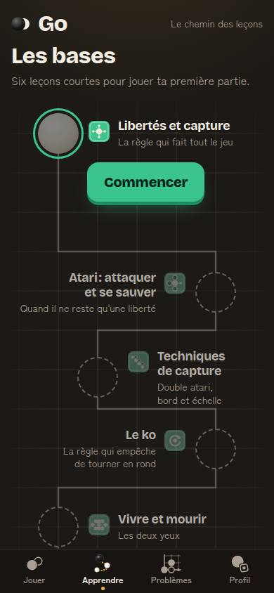 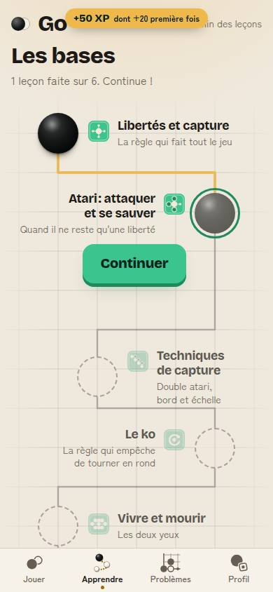 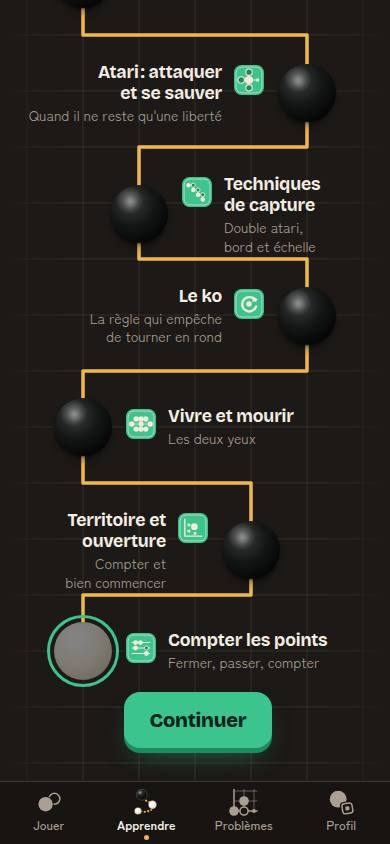

Ce qui marche : on comprend en 3 secondes. Titre « Les bases », une phrase, une pierre en relief et **un seul** bouton (« Commencer », puis « Continuer »), visible sans défiler. Les pierres faites sont noires et reliées par un trait or ; les suivantes sont en pointillés. Le chemin suit les lignes d'un goban : c'est l'identité du go, pas une copie de Duolingo. Pas de cœurs, pas d'énergie, pas de cadenas sur les leçons : on peut ouvrir n'importe quelle leçon. C'est exactement ce qu'il faut garder.

- **Duolingo** a remplacé en 2022 sa grille de compétences par un chemin unique, parce que les apprenants ne savaient pas s'ils utilisaient l'app « de la bonne façon » ; les révisions sont intégrées au chemin (source 1). Notre chemin fait la même chose pour l'ordre, **mais pas pour les révisions** (constat A5).
- **Duolingo** limite l'usage gratuit : 5 cœurs perdus à chaque erreur, puis, depuis 2025, une « énergie » qui baisse à **chaque** exercice, même juste ; accueil très critique (source 2). **À ne pas copier** : cela punit l'erreur, et notre charte veut que l'erreur devienne une leçon.

## 2. Dans une leçon

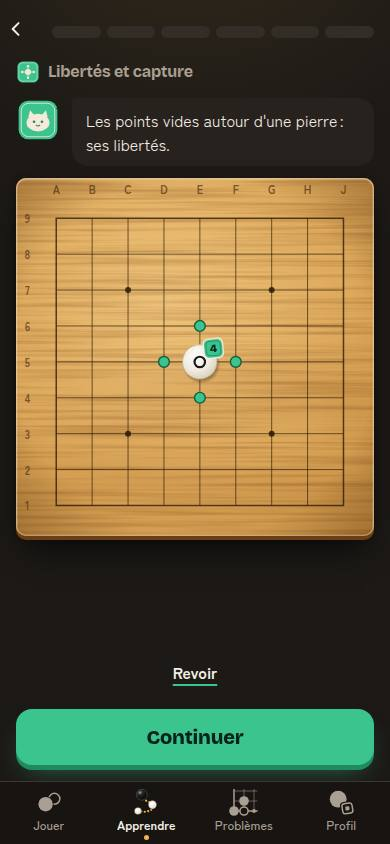 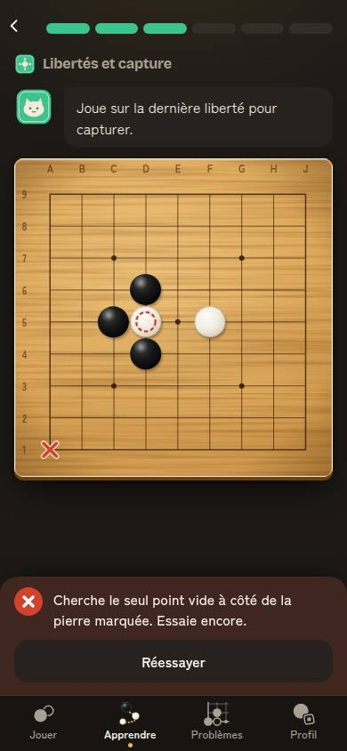 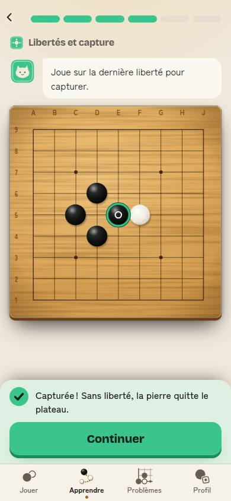

Ce qui marche : barre d'étapes en segments, Mochi dit une phrase courte, le plateau prend la place, un gros bouton en bas. L'erreur est gentille et utile (« Cherche le seul point vide à côté de la pierre marquée »), la réussite explique (« Capturée ! Sans liberté, la pierre quitte le plateau »). Son et vibration à chaque réponse.

- **A2. On lit trois écrans avant de jouer.** Leçon 1 : « Commencer », puis trois démonstrations à regarder (« Continuer » ×3) avant le premier geste. Sur les 6 leçons de `main`, 64 % des étapes se regardent sans rien toucher. La charte dit « apprendre en jouant, pas en lisant ». *Comparaison* : dans une leçon Duolingo, le premier écran est déjà un exercice ; chez **chess.com**, les nouvelles leçons du parcours « Learn » sont des exercices guidés par le coach, et les anciennes leçons vidéo finissent par des « challenges » à résoudre avant de continuer (source 3).
- **A3. L'erreur coûte un tap et cache la question.** Après une erreur, la feuille rouge couvre le bas de l'écran ; au quiz de la leçon 7, elle **cache les trois réponses** (capture 11) : il faut toucher « Réessayer » pour les revoir. Sur le plateau, le coup est pourtant rejouable directement. *Comparaison* : **Lichess** (puzzles) laisse rejouer sur le plateau sans bouton ; Duolingo repose la question ratée plus tard dans la même leçon.

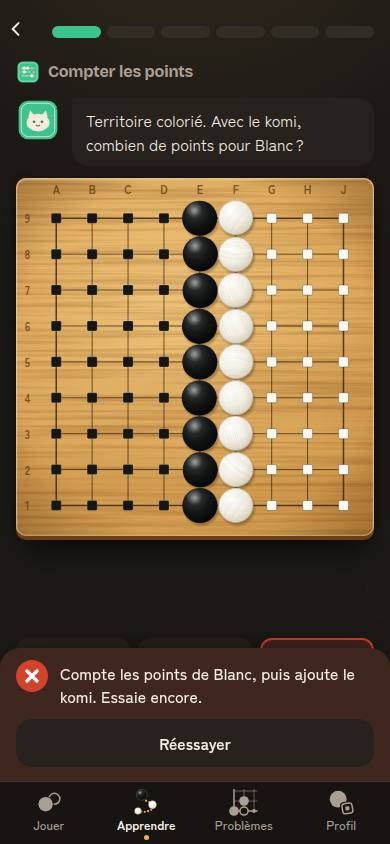 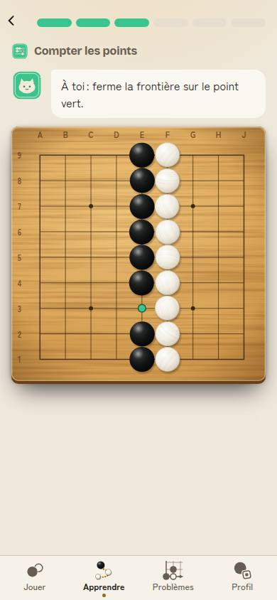

## 3. La leçon 7 « Compter les points » (branche `lecon-compter`)

Bonne leçon, et elle arrive au bon moment : elle répond au creux de fin de partie vu le 28/09 (komi, frontières ouvertes, quand passer). 4 étapes sur 6 demandent un geste, le komi est expliqué dès la première phrase, le point vert montre où fermer. Le chemin dit « Sept leçons courtes » et la fin de chapitre dit « Tu sais fermer tes frontières, passer au bon moment et compter la partie. Tu connais les règles du go. »

- **A7.** Deux détails : le quiz « combien de points pour Blanc ? » demande de compter 27 carrés sur le plateau (la démonstration d'avant compte pour toi, mais les carrés ne sont plus numérotés) ; et « Bientôt » annonce toujours un chapitre « Fin de partie et comptage », ce qui fait doublon avec la leçon 7 pour un débutant.

## 4. Fin de leçon et fin de chapitre

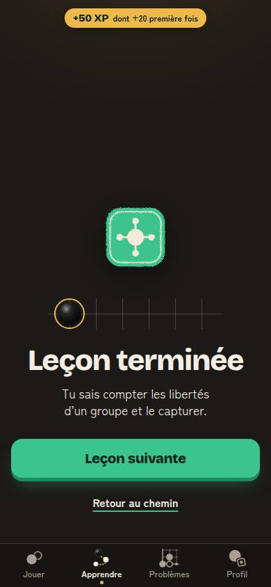 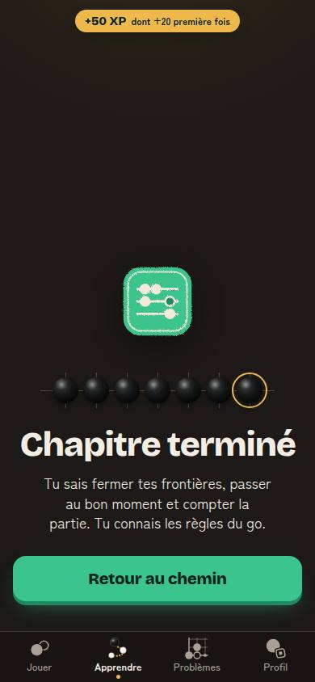

Ce qui marche : le sceau s'imprime, la pierre se pose sur la rangée (avec son claquement), « +50 XP dont +20 première fois », l'acquis en une phrase (« Tu sais compter les libertés d'un groupe et le capturer. »), une action. Célébration modeste, confettis seulement pour la fin du chapitre : bon dosage.

- **A4. La leçon ne mène nulle part ailleurs.** Fin de leçon : « Leçon suivante ». Fin de chapitre : « Retour au chemin », qui propose ensuite « Revoir : Libertés et capture ». Le chapitre promet pourtant « Six leçons courtes pour jouer ta première partie », et aucun bouton ne propose cette partie, ni un problème sur la notion qu'on vient d'apprendre. *Comparaison* : chess.com met les challenges juste après la notion (source 3) ; **Lichess** range ses problèmes par **thèmes** (fourchette, clouage…) et un tableau de bord montre ses thèmes forts et faibles, avec les problèmes ratés à rejouer (source 4).
- **A5. Aucune révision.** Une leçon faite ne revient jamais, sauf si le joueur la rouvre. *Prouvé* : se tester fait mieux retenir que relire, à 2 jours et à 1 semaine (Roediger et Karpicke, 2006, source 5) ; Duolingo a gagné +12 % d'engagement quotidien en planifiant ses révisions avec un modèle d'oubli (Settles et Meeder, 2016, source 6). Nous avons déjà ce principe pour « Tes erreurs à rejouer » (prochain passage au lendemain), pas pour les leçons.
- **A6. La série ne compte que le Go du jour.** Un joueur qui fait une leçon par jour garde « 0 jour de suite ». Chez **Duolingo**, n'importe quelle leçon entretient la série.

## 5. L'onglet Problèmes

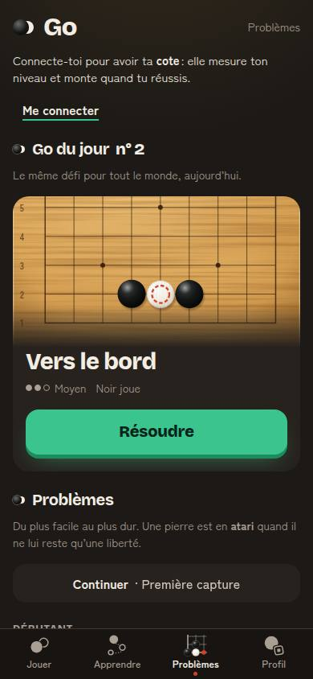 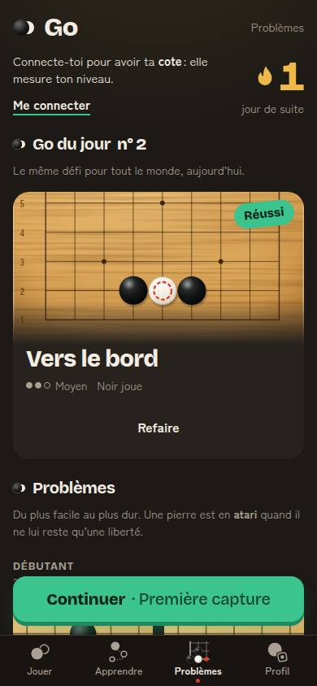 

Ce qui marche : le Go du jour est mis en scène (vraie position, recadrée, gros « Résoudre ») ; une fois fait, « Réussi » en tampon et « Continuer · Première capture » devient le bouton en relief, collé en bas de l'écran. La série s'affiche dès le jour 1 sans compte (flamme or, « 1 jour de suite »). « Continuer » propose toujours un problème, même quand tout est réussi (tirage au hasard) : il n'y a pas de fin.

- **B1. La page montre sa fin, et un mur de cadenas.** 20 écrans de haut, 117 miniatures dont 103 grisées, 4 paliers « verrouillés ». La décision « pas de fin visible » (#137, #147) est respectée pour les compteurs (« N réussis », jamais de total), mais la grille elle-même montre le total et la fin. Le premier texte lu n'est pas le Go du jour mais « Connecte-toi pour avoir ta cote : elle mesure ton niveau et monte quand tu réussis. » + « Me connecter ». 700 mots sur la page. *Comparaison* : **chess.com Puzzles** ouvre directement un problème à ton niveau et enchaîne le suivant ; **Lichess** `/training` aussi, les thèmes sont une page à part ; **BadukPop** propose chaque jour 15 problèmes et plus, tirés au hasard, au niveau que tu as choisi, dans un stock de 4 000 (source 7) : on ne voit jamais le stock. **Candy Crush** montre une carte, mais elle s'ouvre sur ton niveau : on voit le prochain pas, pas le bout du chemin (source 8).
- **B2. « Voir la suite » donne la réponse, puis compte une réussite.** Après **un** essai raté, « Voir la suite » pose le bon coup : « Voilà la suite. Le coup marqué est la réponse. » (capture 20). On touche « Réessayer », on joue le coup montré : « Bravo, c'est le bon coup ! », +30 XP, série +1, tampon « Réussi » (captures 21, 22) et texte de partage « résolu en 2 essais ». Seule la cote (avec compte) est protégée. *Comparaison* : **Lichess Puzzle Streak** s'arrête au premier coup faux, avec **un** « passer » par série (source 9) ; **chess.com** Puzzle Rush s'arrête à la 3e erreur (source 10) ; dans les deux, voir la réponse n'est jamais une réussite. Mais **chess.com** garde la série du problème du jour même quand on n'a plus de cœur (base de connaissances) : on peut être honnête sans punir.
- **B3. L'échec n'explique rien.** Les 6 problèmes de base n'ont ni `explanation` ni `refutation` : « Pas tout à fait. Essaie encore. » puis « Bravo, c'est le bon coup ! ». « Voir la suite » ne montre qu'**un** coup (la réponse), jamais pourquoi E1 échoue (Blanc s'échappe vers le haut). La charte promet « la suite montrée jusqu'au bout ». *Prouvé* : un retour qui explique fait mieux apprendre qu'un simple « juste / faux » (méta-analyse, source 11).
- **B4. Le Go du jour est « Moyen » dès le jour 2** (n° 2 : 650 ; n° 3 : 500 ; le n° 1 : 400). Déjà noté le 27/09 (hypothèse : piste Débutant les 7 premiers jours). *Prouvé en laboratoire* : on apprend le plus vite autour de 85 % de réussite (source 12).
- **B5. La réussite du Go du jour ne montre pas la série.** Action en relief : « Partager ». La flamme n'apparaît qu'après le retour à la liste. Le bandeau « +30 XP » recouvre le titre « Go du jour n° 2 / Vers le bord » (capture 21). *Comparaison* : **Duolingo**, après la leçon, montre un écran de série (flamme animée, compteur qui monte) ; **Wordle** montre statistiques, série, puis la grille de partage sans spoiler, qui a fait sa croissance (source 13).

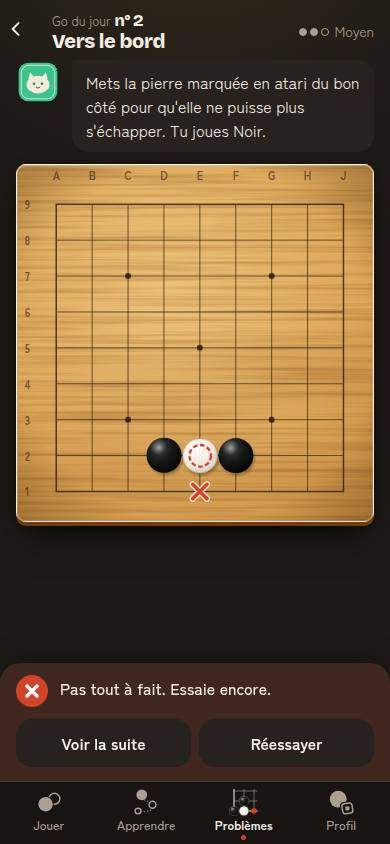 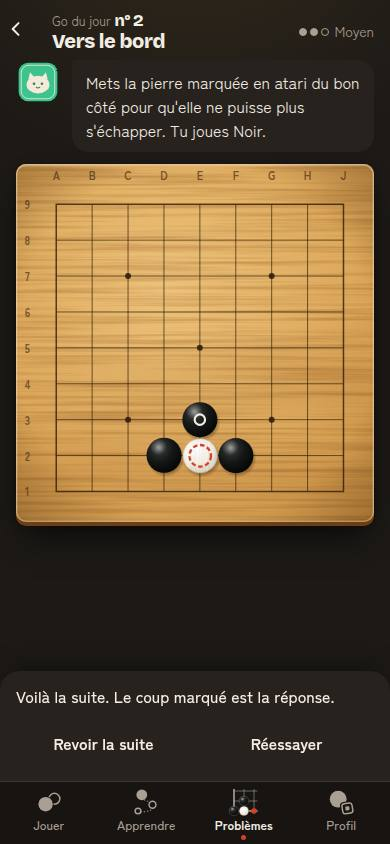 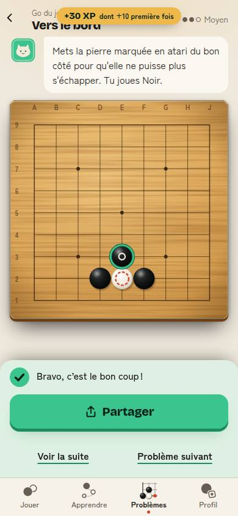

## 6. « Tes erreurs à rejouer »

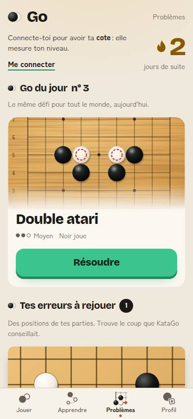 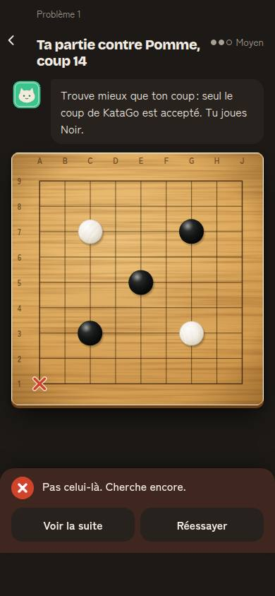

C'est notre meilleur atout face à chess.com et BadukPop (charte, point 3) : une position de **ta** partie, repassée le lendemain. Bien placée, entre le Go du jour et la grille, avec un compteur.

- **B7.** L'écran se lit mal : « Problème 1 » en petit au-dessus du titre, une difficulté « Moyen » qui ne veut rien dire ici, et « Trouve mieux que ton coup : seul le coup de KataGo est accepté. » (technique, un peu sec). On ne voit pas où tu avais joué. *Comparaison* : **Lichess** « Apprendre de tes erreurs » montre le coup joué et demande « trouve mieux » (base de connaissances).

## 7. Accessibilité

Aucune cible de moins de 44 px sur les écrans mesurés. Barre d'étapes en `progressbar` avec texte ; boutons du chemin nommés (« Leçon 2 : Atari…, prochaine étape »). Contraste correct dans les deux thèmes à l'œil ; les titres des leçons à venir restent lisibles. Mouvements réduits respectés (démonstrations à l'état final, « Voir la suite » sans animation). Rien de bloquant ; la longueur de l'onglet Problèmes (117 boutons à parcourir au lecteur d'écran) est le vrai problème d'accessibilité.

---

## Constats classés

Impact : sur les indicateurs de `entreprise/charte.md` (J1 / J7 / J30, parties terminées par semaine, première pierre). Effort : S (moins d'un jour), M (2 à 4 jours), L (plus).

| # | Constat | Impact | Effort | Proposition | Indicateur qui doit bouger |
|---|---|---|---|---|---|
| **B1** | Problèmes : 20 écrans, 117 miniatures, 88 % de cadenas, la fin est visible | **Fort** (J7) | M | **Un écran, une action.** Haut : Go du jour ; puis un seul « Continuer » ; puis le palier en cours en une carte (« Débutant · 5 réussis », 3 miniatures suivantes) ; les autres paliers en une ligne (« Prochain : Novice, encore 3 réussites »). Grille complète derrière « Tous les problèmes ». Invitation au compte sous le Go du jour, pas au-dessus. | problèmes résolus par joueur actif et par semaine ; part des visites de l'onglet avec au moins un problème ouvert (`probleme_ouvert` à créer) |
| **B2** | « Voir la suite » donne la réponse, puis réussite, XP, série et « résolu en 2 essais » | **Fort** (confiance, charte point 4) | S | **Indices gradués**, sans punition : 1er échec → Mochi montre la zone (« Regarde du côté du bord ») ; 2e échec → « Montre-moi » joue la réponse **et** la suite. Problème vu : « Vu » au lieu de « Réussi », pas d'XP, texte de partage « avec l'aide de Mochi ». La série du Go du jour **tient quand même** (l'effort du jour compte). | taux de réussite du Go du jour sans aide ; `solution_vue` à créer ; J1 stable |
| **B3** | L'échec n'explique pas ; « la suite » = un seul coup | **Fort** (apprentissage, charte point 3) | M | Après un coup faux, Blanc **joue sa réfutation** sur le plateau (600 ms) avec une phrase : « Blanc s'échappe par E4. » Écrire `explanation` et `refutation` des 6 problèmes de base d'abord, puis des 117. | réussite au 2e essai ; notes « trop dur » dans les retours |
| **A2** | 3 écrans à regarder avant le premier geste ; 64 % des étapes sans geste | **Fort** (J1) | M | **Chaque démonstration devient un geste** : « Touche les libertés de la pierre » (type `touche`, déjà là), puis la démonstration répond. Cible : un geste dès le 1er écran, et au plus 1 étape sans geste sur 3. | `lecon_terminee` rang 1 ÷ `lecon_commencee` (à créer) ; temps jusqu'au premier geste |
| **A6** | La série ne compte que le Go du jour | **Fort** (J7) | S | **La série compte « un défi par jour »** : Go du jour, **ou** une leçon, **ou** la révision du jour. Le Go du jour reste l'action proposée. | J7 ; part des jours actifs sans Go du jour |
| **A5** | Aucune révision des leçons | Moyen (J7, J30) | M | **« Révision du jour »** : 3 étapes déjà réussies (quiz et coups) tirées des leçons faites, à J+1, J+3, J+7 ; même moteur que « Tes erreurs à rejouer ». Pas de pierre qui « se fissure » ni de perte : seulement une proposition. | J7, J30 ; réussite des révisions |
| **A4** | La leçon ne mène ni à un problème ni à une partie | Moyen (parties / semaine) | S | Fin de leçon : lien « 3 problèmes d'atari » (thème de la leçon). Fin de chapitre : bouton principal **« Joue contre Pomme »**, « Retour au chemin » en lien. Étiqueter les problèmes par thème de leçon. | parties commencées dans les 24 h après la fin du chapitre ; `partie_terminee` par semaine |
| **B5** | La réussite du Go du jour cache la série ; « +30 XP » recouvre le titre | Moyen (J1) | S | Feuille de réussite : « 🔥 2 jours de suite. Demain : Go du jour n° 3. » avec la flamme qui monte ; « Continuer » en relief, « Partager » à côté (en relief à partir du 3e jour, hypothèse déjà notée) ; bandeau XP sous l'en-tête. | J1 ; `go_du_jour_partage` |
| **A3** | L'erreur demande « Réessayer » ; au quiz, elle cache les réponses | Moyen (fin de leçon) | S | Feuille d'erreur plus basse et sans bouton : on rejoue directement ; au quiz, la mauvaise réponse devient rouge et les autres restent touchables. | taps par leçon ; abandons en cours de leçon |
| **B7** | « Tes erreurs » : en-tête confus, difficulté fausse, texte technique | Moyen (charte point 3) | S | En-tête « Ta partie contre Pomme · coup 14 » ; pas de difficulté ; ta pierre d'origine en fantôme ; texte « Tu avais joué ici. Trouve mieux. » | réussite des erreurs rejouées ; `erreur_rejouee` au J+1 |
| **B4** | Go du jour « Moyen » dès le jour 2 | Moyen (J1-J7) | S | Piste Débutant les 7 premiers jours (déjà dans la base). | réussite du Go du jour au 1er essai des jours 2 à 7 ; J7 |
| **B6** | Pas de mode « défi » pour les joueurs accrochés | Faible aujourd'hui | M | Plus tard : « Combien d'affilée ? » (façon Lichess Streak), sans chrono, un « passer » par série, record personnel ; **jamais** de vies à racheter. | problèmes par joueur actif, joueurs de club |
| **A7** | Leçon 7 : 27 carrés à compter ; « Bientôt » fait doublon | Faible | S | Numéroter les colonnes (« 9, 18, 27 ») au quiz ; renommer le chapitre à venir « Fin de partie avancée ». Fusionner la branche vite : elle soigne le creux du comptage. | réussite du quiz komi |

## Les 5 propositions les plus fortes

1. **Problèmes : un écran, une action** (B1). Go du jour, un « Continuer », le palier en cours ; la grille de 117 et ses 103 cadenas derrière un lien. Indicateur : problèmes résolus par joueur actif et par semaine.
2. **La réponse vue n'est pas une réussite, et l'échec s'explique** (B2 + B3). Indice, puis réfutation jouée sur le plateau, puis la réponse ; « Vu » au lieu de « Réussi », sans casser la série. Indicateurs : réussite sans aide, `solution_vue`.
3. **Jouer dès le premier écran d'une leçon** (A2 + A3). Chaque démonstration devient un geste ; l'erreur se corrige sans bouton. Indicateur : leçons terminées ÷ leçons commencées, J1.
4. **Une seule boucle quotidienne** (A6 + A5). La série compte aussi une leçon ou la « Révision du jour » (3 exercices espacés). Indicateur : J7.
5. **De la leçon à la pratique** (A4 + B5). Fin de leçon → 3 problèmes du même thème ; fin de chapitre → « Joue contre Pomme » ; la réussite du Go du jour montre d'abord la série. Indicateurs : parties terminées par semaine, J1.

Événements à créer pour mesurer tout cela : `lecon_commencee`, `probleme_ouvert`, `solution_vue`, `revision_faite`.

## Sources

1. [Duolingo, new home screen design (2022)](https://blog.duolingo.com/new-duolingo-home-screen-design) ; [Duolingo for Schools, the new homescreen](https://duolingoschools.zendesk.com/hc/en-us/articles/6829627901197-The-new-Duolingo-homescreen)
2. [Duolingo Wiki, Energy](https://duolingo.fandom.com/wiki/Energy) ; [Class Central, Duolingo breaks hearts for energy](https://www.classcentral.com/report/duolingo-breaks-hearts-for-energy/) ; [Android Authority](https://www.androidauthority.com/quitting-duolingo-energy-system-3599842/)
3. [chess.com Help, How do Lessons work](https://support.chess.com/en/articles/8609703-how-do-lessons-work-on-chess-com)
4. [Lichess sur X, Puzzle dashboard](https://x.com/lichess/status/1349459526014136320) ; [lichess-org/mobile, PR #2651](https://github.com/lichess-org/mobile/pull/2651)
5. [Roediger et Karpicke, Test-Enhanced Learning, Psychological Science, 2006](https://journals.sagepub.com/doi/10.1111/j.1467-9280.2006.01693.x)
6. [Settles et Meeder, A Trainable Spaced Repetition Model for Language Learning, ACL 2016](https://aclanthology.org/P16-1174/)
7. [BadukPop, App Store](https://apps.apple.com/us/app/badukpop-go/id1472684271) ; [badukpop.com](https://badukpop.com/)
8. [Candy Crush Saga Wiki, Map](https://candycrush.fandom.com/wiki/Map) ; [Game Developer, Rethinking progression in mobile puzzle games](https://www.gamedeveloper.com/design/rethinking-progression-in-mobile-puzzle-games)
9. [Lichess, Puzzle Streak](https://lichess.org/streak) ; [annonce Lichess sur X](https://x.com/lichess/status/1376521271463190541)
10. [chess.com, Puzzle Rush](https://www.chess.com/puzzles/rush) ; [chess.com, new Puzzle Rush formats](https://www.chess.com/news/view/feature-new-puzzle-rush-formats-released)
11. Van der Kleij, Feskens et Eggen, *Effects of feedback in a computer-based learning environment on students' learning outcomes: a meta-analysis*, Review of Educational Research, 2015, [doi:10.3102/0034654314564881](https://doi.org/10.3102/0034654314564881)
12. [Wilson et al., The Eighty Five Percent Rule for optimal learning, Nature Communications, 2019](https://www.nature.com/articles/s41467-019-12552-4)
13. [TechCrunch, entretien avec Josh Wardle](https://techcrunch.com/2022/01/12/josh-wardle-interview-wordle/) ; [Slate, Wordle](https://slate.com/culture/2022/01/wordle-game-creator-wardle-twitter-scores-strategy-stats.html)
