# La partie contre Pomme, du premier coup à « Rejouer » — 28 septembre 2026

Auteur : agent `ux-jeux-mobiles` (mission 2 : game feel de la partie). Build : `main` à `921cb66`, `VITE_E2E=1 npm run build`, `vite preview` sur le port 4636. Chromium de `/opt/pw-browsers`, 390 × 844, `fr-FR`, écran tactile. Aucun code de l'app modifié.

## Méthode et limites

- 4 parties complètes jouées par script Playwright contre Pomme, chacune jusqu'à la revue et « Rejouer d'ici » :
  - **A** : toute première partie (stockage vide, consentement déjà répondu), en sombre puis en clair ;
  - **B** : deuxième partie (`go.parties.v1 = { n: 1, ordi: 1 }`), pour voir la barre d'avantage, en sombre puis en clair.
- Le joueur scripté joue comme un débutant appliqué : il capture une pierre en atari, sauve un groupe en atari, met en atari si possible, sinon suit une liste de points « raisonnables ». Quand la liste est vide, il **passe**, comme le lui conseille Mochi.
- Mesures dans la page : délai entre la confirmation du coup et le retour du bouton « Passer » (= fin du tour de Pomme), appels à `navigator.vibrate` (espionnés), sources Web Audio créées (espionnées), position du plateau.
- Lecture du code : `src/app/Game.tsx`, `src/ui/sound.ts`, `src/ui/haptics.ts`, `src/app/partie.ts`, `src/app/repliques.ts`, `src/ui/FinPartie.tsx`, `src/ui/RecitScore.tsx`, `src/app/Revue.tsx`, `src/engine/simple.ts`.
- Limites : pas de vrai joueur ; pas de son entendu (on voit que le son part, pas ce qu'il vaut) ; Chromium n'est pas Safari iOS. **Le réseau KataGo n'est pas téléchargé dans ce conteneur** (`public/models/` absent) : la barre d'avantage et la revue tournent sur le moteur simple, comme chez un joueur dont KataGo n'est pas encore chargé. Pomme tire ses coups au hasard parmi ses bons coups : chaque partie est différente. Les durées « humaines » sont des **hypothèses**.

## Les chiffres des 4 parties

| | A sombre | A clair | B sombre | B clair |
|---|---|---|---|---|
| Coups au total | 86 | 92 | 84 | 112 |
| Réponse de Pomme, médiane (min–max) | 376 ms (218–451) | 370 ms (228–494) | 344 ms (181–473) | 316 ms (134–444) |
| Passes du joueur avant le comptage | **10** | **21** | **11** | **23** |
| Phase de comptage manuelle | oui | oui | oui | non |
| Résultat | Défaite de 20,5 | Défaite de 61,5 | Victoire de 1,5 | Victoire de 38,5 |
| Précision affichée dans la revue | Toi 97 % | Toi 99 % | Toi 91 % | Toi 99 % |
| Bilan de Mochi dans la revue | « Très belle partie… Aucune erreur » | idem | « Très belle partie… Ton coup 43 t'a coûté 7 points » | – |

Sons et vibrations du premier coup (partie A sombre, en ms après la confirmation) : vibration de 12 ms à **20 ms**, 16 sources audio entre 18 ms (claquement de ta pierre) et 385 ms (claquement de la pierre de Pomme). Capture : vibration `[20, 40, 20]`. Coup interdit : 30 ms. Victoire : `[30, 60, 30]` après le récit. Défaite : ni son ni vibration.

---

## 1. Le premier coup

 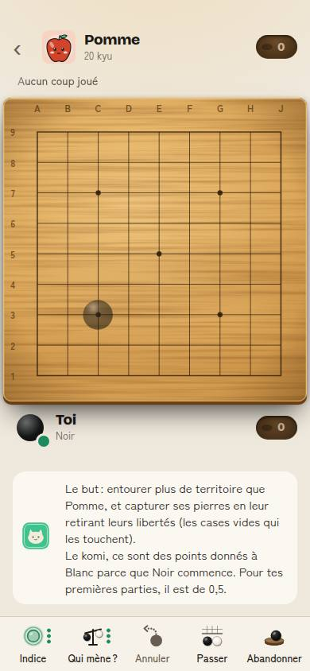 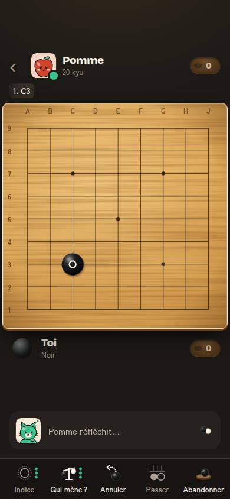

Ce qu'on voit : plateau lisible, Mochi explique le but et le komi (deux phrases, 55 mots). Première touche : pierre fantôme. Seconde touche : la pierre claque, vibre, puis « Pomme réfléchit… ».

- **C1. Le plateau saute de 52 px sous le doigt après le premier coup** (partie A : haut du plateau à y = 122 avant, 174 après ; partie B : 9 px). Cause : la bulle d'intro de Mochi (6 lignes) est remplacée par une bulle d'une ligne, et la colonne est centrée verticalement. Le débutant voit tout le plateau glisser au moment même où il pose sa première pierre. En jeu mobile, rien ne bouge sous le doigt pendant un geste (Candy Crush, chess.com : plateau fixe, seuls les bandeaux changent).
- Le son de ta pierre part à 18 ms : c'est très bien (sous le seuil de 100 ms où l'action paraît instantanée, source 11).

## 2. Le rythme des réponses de Pomme

- **C2. Pomme répond en 0,35 s, toujours.** Médiane 316 à 376 ms sur 4 parties, écart faible, que le coup soit évident ou non. `Game.tsx` impose un minimum de 350 ms ; Pomme cherche 150 ms. On lit à peine « Pomme réfléchit… » (visible 0,3 s) et le portrait « pensif » n'a pas le temps de se voir.
- Comparaison : **chess.com** jouait ses bots plus vite ; beaucoup de membres n'aimaient pas, un délai a été ajouté et il n'y a pas de réglage pour l'enlever (source 1). Chez nous, le délai est fixe : il ne dit rien de la difficulté du coup.
- Nuance : ta propre pierre doit rester instantanée (loi de Doherty, 400 ms, source 2). C'est la réponse de l'adversaire qui gagne à paraître humaine : une pause variable donne le temps de voir sa pierre, d'entendre le claquement et de lire la réplique.

## 3. Captures et atari : les moments forts

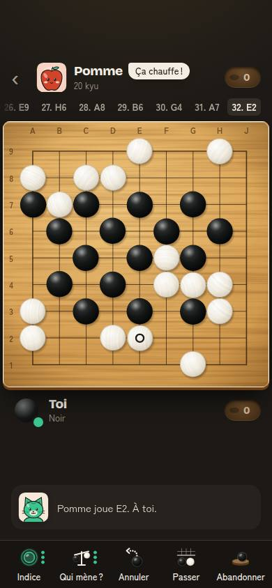 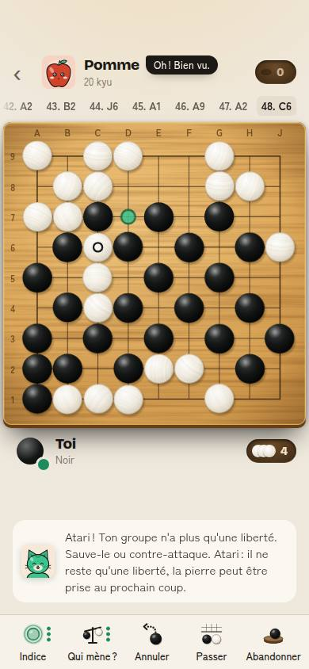

- **C3. Ta capture n'est jamais félicitée par écrit.** `onPlay` écrit « Bravo, tu captures 1 pierre ! », mais la bulle de Mochi affiche « Pomme réfléchit… » dès le rendu suivant (`messageCoach`), puis « Pomme joue X. À toi. ». Sur 4 parties et 26 coups de capture du joueur, le script n'a **jamais** vu le message. Restent : le claquement suivi des pierres qui tombent sur le tas, une vibration (Android), les pierres qui volent vers le couvercle, et la réplique de Pomme (« Aïe ! », « Bien joué ! », 3 s). C'est déjà du bon travail, mais le moment le plus fort de la partie pour un débutant (le pic, au sens de la règle pic-fin) dure 0,35 s avant que Pomme rejoue.
- **C4. Mettre Pomme en atari est silencieux.** `playAtari()` n'est joué contre l'ordi que quand **Pomme** te met en atari (`if (!ai && enAtari)`). Ton atari n'a ni son ni liberté montrée, seulement « Oups… » ou « Tu me serres. » dans la bulle.
- **C5. L'alerte d'atari est longue.** « Atari ! Ton groupe n'a plus qu'une liberté. Sauve-le ou contre-attaque. Atari : il ne reste qu'une liberté, la pierre peut être prise au prochain coup. » : 4 lignes, le mot « atari » deux fois. Le point vert de la liberté est petit (capture 05) et l'animation de 700 ms passe pendant qu'on lit.
- Aucune vibration pour l'atari subi (le moment où il faut réagir).
- Comparaison : **chess.com** : les bots parlent aux moments clés, dont la première capture (source 3). **Clash Royale** : chaque tour détruite a son fracas et une couronne qui vole vers le score, puis l'adversaire peut répondre par une émote animée à côté de sa tour (source 4). La **bulle de Pomme** reprend ce principe : c'est une réussite (15 caractères, 3 s, ne cache rien).

## 4. La barre d'avantage (à partir de la 2e partie)

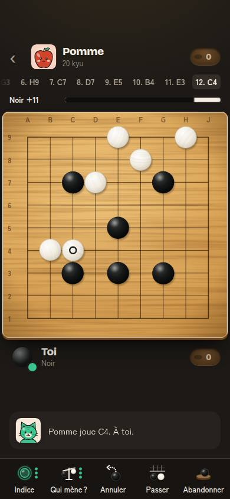

- **C6. Elle se lit mal et elle saute.** Libellé « Noir +11 » en petit, barre de 6 px. Le joueur s'appelle « Toi » partout ailleurs. D'un coup à l'autre : +47,5 puis +32,5 (−15 points sur un coup ordinaire) ; +36 puis +26,5. Fin de la partie B sombre : la barre dit **« Blanc +2 »**, le résultat dit **« Victoire de 1,5 point »**. La contradiction déjà vue le 27/09 est toujours là (moteur simple).
- Comparaison : la barre d'évaluation de **chess.com** et de **Lichess** est verticale, pleine hauteur, avec un chiffre dans la barre. Cacher la barre à la première partie (#160) est un bon choix pour un débutant ; le problème est ce qu'elle dit ensuite.

## 5. Passer : le vrai trou de la partie

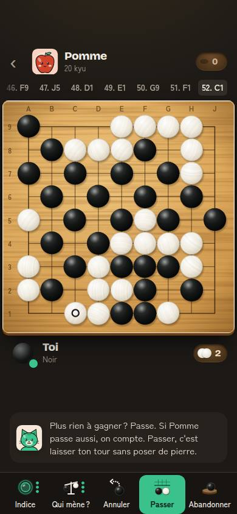 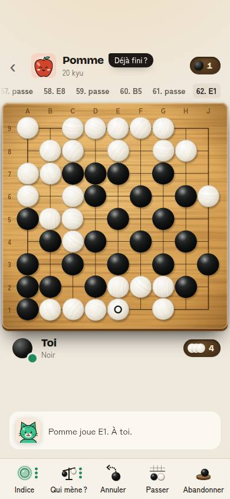 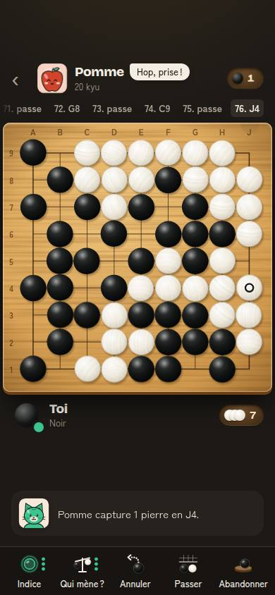

- **C7. Quand tu passes, Pomme ne passe pas : elle joue chez toi.** Sur 4 parties, il a fallu **10, 21, 11 et 23 passes** du joueur pour finir. Pendant ces passes, Pomme a capturé 6 pierres d'un coup (E6, partie A sombre), puis 4 (B7, partie B sombre). Cause (`src/engine/simple.ts`, l. 133-137) : après ta passe, Pomme ne passe que si elle se croit gagnante ; sinon elle continue, et chaque passe lui offre un coup gratuit.
- Pendant ce temps, Mochi dit « Pomme joue G2. À toi. » et Pomme répond à ta passe « Tu es sûr ? », « Déjà fini ? » avant de jouer dans ta zone. Le joueur ne comprend pas pourquoi la partie ne s'arrête pas, ni qu'il doit répondre.
- Le conseil « Plus rien à gagner ? Passe. » (#120) arrive au coup 26 (partie A sombre) et au coup 56 (A clair) alors que de grandes zones restent ouvertes (capture 07 : tout le côté droit). Le bouton « Passer » passe en vert.
- Ce creux vient juste avant la fin : c'est le pire endroit selon la règle pic-fin.
- Comparaison : **OGS** avertit s'il reste des frontières ouvertes (base de connaissances, « Boucle de jeu »). **chess.com** n'a pas de passe, mais propose « Nulle ? » et les bots l'acceptent ou la refusent par une phrase.

## 6. Comptage et récit du score

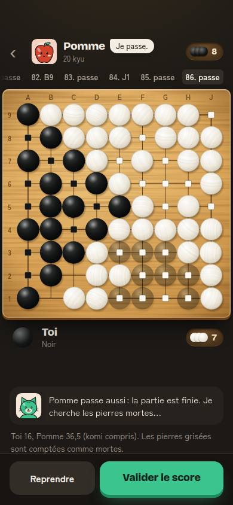 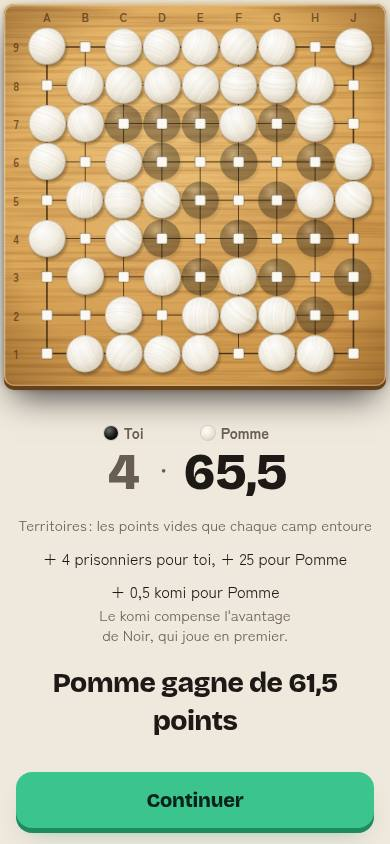

- **C8. La phase manuelle reste fréquente** : 3 parties sur 4 (« Reprendre » / « Valider le score », avec « Les pierres grisées sont comptées comme mortes »). Le comptage automatique (#117) ne s'applique que sans groupe incertain.
- **C9. Le récit est beau, mais ses chiffres ne collent pas avec l'écran suivant.** Récit : « + 7 prisonniers pour toi, + 17 pour Pomme ». Écran de fin, une seconde plus tard : « Pomme a pris 8 pierres ». Les 9 pierres mortes comptées comme prisonniers ne sont pas dites. Le komi est expliqué (« Le komi compense l'avantage de Noir… ») : bien.
- Le récit dure 2,5 s + 1,2 s, se saute d'un toucher et laisse « Continuer » en action unique. Comparaison : le **« Sugar Crush »** de Candy Crush transforme la fin du niveau en cascade de points annoncée à voix haute (source 5). Notre récit a la bonne structure ; il lui manque un son par étape (territoire, prisonniers, komi, résultat).

## 7. Écran de fin

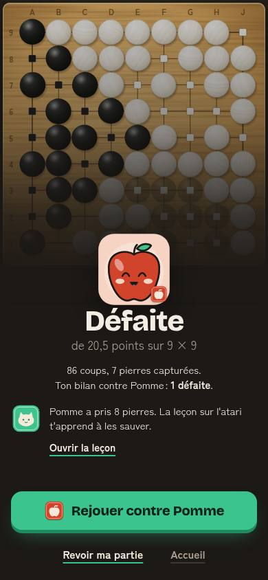 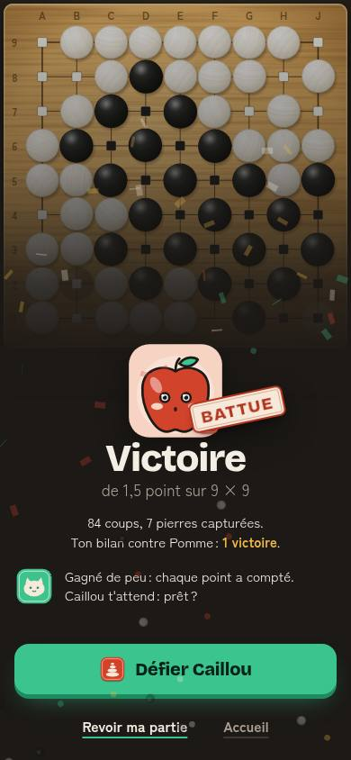

- Victoire : sceau de Pomme tamponné « BATTUE », confettis, carillon, vibration, « Défier Caillou ». Défaite : Pomme contente, leçon de Mochi utile (« Pomme a pris 8 pierres. La leçon sur l'atari t'apprend à les sauver. »), « Rejouer contre Pomme ». Une seule action principale, en bas, à 715 px : c'est l'écran le plus réussi de la partie.
- **C10. L'XP gagnée n'est pas montrée.** `gagnerXp()` est appelé en silence à la fin (`Game.tsx`, l. 367). Déjà noté le 27/09, toujours vrai.
- Défaite de 61,5 points (partie A clair) : l'écran dit « de 61,5 points sur 9 × 9 », sans nuance. Un débutant qui a passé 21 fois ne sait pas que l'écart vient surtout de ces passes.

## 8. Revue coup par coup et « Rejouer d'ici »

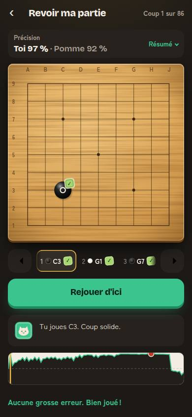 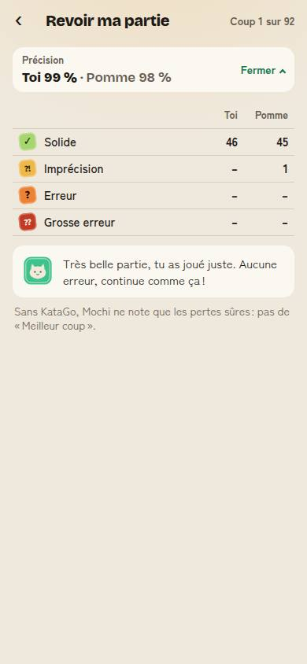 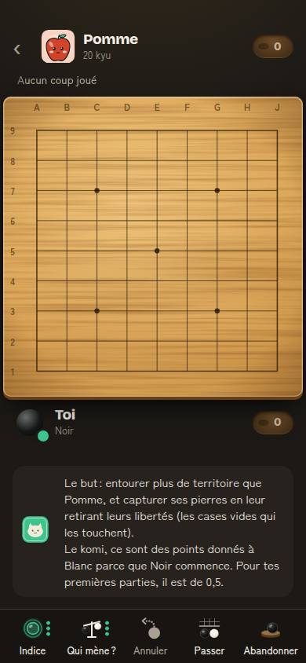

- **C11. La revue félicite une lourde défaite.** Partie A sombre : défaite de 20,5 points, 8 pierres perdues. Revue : « Précision Toi 97 % », « Aucune grosse erreur. Bien joué ! », « Très belle partie, tu as joué juste. Aucune erreur, continue comme ça ! ». Même chose à 99 % après une défaite de 61,5 points. Les passes qui ont offert des coups gratuits ne sont pas notées. Sans KataGo, le moteur simple ne voit que les « pertes sûres » ; la phrase de Mochi devrait alors être prudente. (Avec KataGo chargé, le résultat peut être différent : à vérifier sur un vrai téléphone.)
- **C12. La revue s'ouvre au coup 1**, avec « Rejouer d'ici » comme action principale. Toucher ce bouton au coup 1 relance une partie vide, avec l'intro de Mochi (capture 16). Les moments clés existent (la courbe montre bien la chute finale) mais il faut les chercher : la courbe est en bas, à moitié hors de l'écran.
- La revue met 7 à 11 s à noter les coups (moteur simple) : le « 97 % » arrive après coup.
- Comparaison : **chess.com Game Review** ouvre sur un résumé (précision, nombre de coups par catégorie), puis « Commencer la revue » : le coach mène aux **moments clés** (un bon coup, une erreur, une tactique manquée), propose de **réessayer** l'erreur et recalcule la précision (sources 6, 7). Chess.com est plus généreux avec les nouveaux joueurs (voir la base de connaissances), mais cette générosité porte sur les notes des bons coups ; elle ne cache pas les erreurs. **Lichess** « Apprendre de tes erreurs » ouvre directement la **première grosse erreur** et demande de trouver mieux (source 8). **BadukPop** : des avis de joueurs regrettent de ne pas pouvoir revenir en arrière pour comprendre pourquoi ils ont perdu des pierres (source 9). Nous avons l'outil (revue, « Rejouer d'ici ») ; il faut l'ouvrir au bon endroit.

## 9. Sons et vibrations : bilan

| Geste | Son | Vibration (Android) | Animation | Manque |
|---|---|---|---|---|
| Ta pierre | claquement bois, 4 variantes, ±3 %, panoramique | 12 ms | chute 140 ms | – |
| Pierre de Pomme | même claquement, plus sourd | – | chute | – |
| Ta capture | claquement + 1, 2 ou 4 pierres sur le tas | `[20, 40, 20]` | pierres vers le couvercle 280 ms | texte jamais vu (C3), pas de « +1 » |
| Pomme capture | idem | – | idem | – |
| Tu mets Pomme en atari | **aucun** | – | – | C4 |
| Pomme te met en atari | deux notes douces | **aucune** | liberté verte 700 ms | vibration |
| Coup interdit | « tok » mat | 30 ms | pierre fantôme qui tremble | – |
| Récit du score | **aucun** | – | territoires un à un | un son par étape |
| Victoire | carillon 4 cloches | `[30, 60, 30]` | tampon + confettis | – |
| Défaite | aucun | – | – | un son doux, non punitif |

- Le son est de très bonne facture (synthèse modale, anti-répétition, session « lecture » pour le mode silencieux de l'iPhone).
- **C13. Sur iPhone, aucune vibration.** Safari n'a pas `navigator.vibrate`. L'astuce de l'interrupteur `<input switch>` (iOS 18) a été bouchée dans iOS 26.5 (source 10). Seul Capacitor (plugin Haptics) donnera des vibrations sur iPhone.
- Petit défaut de code, sans effet visible : `src/ui/sound.ts` redéfinit `vibrate`, `VIBRATIONS` et `hapticStone…`, déjà dans `src/ui/haptics.ts`. À signaler à l'agent front.

---

## Constats classés

Impact : effet attendu sur les indicateurs de `entreprise/charte.md` (rétention J1/J7, parties terminées par joueur actif et par semaine, note des stores). Effort : S (moins d'une journée), M (2 à 3 jours), L (plus).

| # | Constat | Impact | Effort | Proposition concrète | Indicateur qui doit bouger |
|---|---|---|---|---|---|
| C7 | Passer ne finit pas la partie ; Pomme mange pendant qu'on passe (10 à 23 passes) | **Très fort** (parties terminées, J1) | M | **Camp** (3 premières parties) : Pomme passe quand tu passes, sauf si une frontière est ouverte ; alors Mochi montre le point : « Pomme n'a pas fini : elle va jouer ici. Ferme d'abord, puis passe. » Hors camp : si Pomme joue après ta passe, Mochi le dit (« Pomme continue : réponds-lui avant de repasser. ») et « Passer » quitte le vert. Réplique « Tu es sûr ? » retirée quand Pomme ne passe pas. | Passes du joueur par partie : médiane ≤ 2 (événement à créer `passe_joueur` avec le rang). Parties terminées (`partie_terminee`) / parties commencées : +10 points. |
| C3, C4 | Ta capture et ton atari n'ont pas de mot, ni de son pour l'atari | Fort (plaisir, 2e partie) | S | Après ta capture, Pomme attend 700 ms de plus. Un « +1 » (ou « +3 ») monte vers ton couvercle. Mochi dit « Bravo, tu captures 1 pierre ! » (garder le message au lieu de « Pomme réfléchit… »). Ton atari sur Pomme : son d'atari plus clair et liberté montrée en or. | Part des joueurs qui lancent une 2e partie dans la session. Événement `capture_joueur` (compte par partie) croisé avec `partie_terminee`. |
| C11, C12 | Revue : félicite une défaite lourde, s'ouvre au coup 1 | Fort (charte point 3, J7) | M | S'ouvrir sur le **moment clé** : la plus grosse perte de points (y compris une passe coûteuse), avec Mochi : « Ici, tu as passé. Pomme a pris 6 pierres. Rejoue ce coup ! » et « Rejouer d'ici ». Bilan cohérent avec le résultat : jamais « aucune erreur » après une défaite de plus de 10 points ; sans KataGo, « Je n'ai pas vu de grosse erreur, mais tu as perdu des pierres ici. » | Taux « Revoir ma partie » → « Rejouer d'ici » (événement à créer `revue_rejouer`). Cible : 30 % des revues. |
| C2 | Pomme répond toujours en 0,35 s | Moyen (sensation, humanité) | S | Délai variable : 500 à 1 200 ms selon la difficulté du coup (plus court pour une réponse forcée), portrait « pensif » visible. Ta pierre reste instantanée. Test A/B contre le délai actuel. | Durée moyenne d'une partie et taux d'abandon en cours de partie ; note de satisfaction d'un sondage PostHog en fin de 3e partie. |
| C1 | Le plateau saute de 52 px après le 1er coup | Moyen (première pierre, 2e coup) | S | Hauteur fixe pour la zone de Mochi (celle de la bulle la plus haute, 6 lignes), ou plateau ancré en haut. Test e2e : position du plateau identique avant et après le premier coup (±2 px). | Coups annulés au 2e coup de la 1re partie ; « première pierre dans la minute » stable. |
| C6 | Barre d'avantage : « Noir », sauts de 15 points, contredit le résultat | Moyen (confiance, note) | M | « Toi +11 » au lieu de « Noir +11 » ; valeur lissée (moyenne des 3 dernières) ; barre plus épaisse (12 px) ; sans KataGo, montrer seulement « Tu mènes / Pomme mène / C'est serré ». | Écart de signe entre la barre au dernier coup et le résultat : < 5 % des parties (à mesurer en ajoutant `avantage_final` à `partie_terminee`). |
| C9 | Récit : « +17 prisonniers » puis « Pomme a pris 8 pierres » | Moyen (compréhension) | S | Récit en 4 lignes distinctes : « Pierres prises : 8 », « Pierres mortes : 9 », puis komi, puis résultat. | Taux « Corriger les pierres mortes » ; questions de retour joueurs sur le score. |
| C8 | Comptage manuel dans 3 parties sur 4 | Moyen | M | Dans le camp, trancher les groupes incertains avec la meilleure estimation, et garder « Corriger » en lien discret. | `comptage_manuel` / `partie_terminee` < 20 %. |
| C5 | Alerte d'atari de 4 lignes | Faible à moyen | S | « Atari ! Ton groupe n'a plus qu'une liberté (le point vert). Sauve-le ! » La définition seulement la 1re fois, à la place de l'alerte, pas en plus. | Part des atari subis suivis d'un coup de sauvetage (événement à créer). |
| C10 | XP gagnée invisible | Moyen (J7) | S | « +30 XP » qui défile sous le bilan, barre de niveau qui avance. | Parties par joueur actif et par semaine. |
| C13 | Pas de vibration sur iPhone | Moyen (sensation iOS) | L (Capacitor) | Plugin Haptics de Capacitor : léger (pose), moyen (capture), notification « warning » (atari subi), « success » (victoire). Ne pas utiliser l'astuce `<input switch>`. | Note moyenne sur l'App Store ; durée des sessions iOS vs Android. |
| – | Récit et défaite sans son | Faible | S | Un « tic » discret par territoire (plafonné), un accord doux et descendant pour la défaite (pas de son d'échec). | Taux de « Rejouer » après une défaite. |

## Les 5 propositions les plus fortes

1. **Le camp de Pomme finit proprement** (C7) : Pomme passe quand tu passes ; sinon Mochi dit pourquoi elle continue. Passes par partie ≤ 2, parties terminées +10 points.
2. **Fêter ta capture** (C3, C4) : message gardé, « +1 » vers le couvercle, Pomme attend 700 ms, son pour ton atari. Mesure : 2e partie dans la session.
3. **Revue qui commence par le moment clé** (C11, C12) et qui ne dit jamais « aucune erreur » après une grosse défaite. Mesure : `revue_rejouer` ≥ 30 % des revues.
4. **Un plateau qui ne bouge pas** (C1) : zone de Mochi de hauteur fixe. Mesure : test e2e à ±2 px, coups annulés au 2e coup.
5. **Pomme qui respire** (C2) : délai variable de 500 à 1 200 ms en A/B. Mesure : taux d'abandon en cours de partie et sondage de fin de 3e partie.

## Sources

1. chess.com, forum « Bots move slow » et « setting bot speed » (délai ajouté parce que les membres n'aimaient pas les coups instantanés) : https://www.chess.com/forum/view/help-support/bots-move-slow, https://www.chess.com/forum/view/site-feedback/setting-bot-speed
2. Doherty et Thadani, *The Economic Value of Rapid Response Time*, IBM, 1982, résumé : https://lawsofux.com/doherty-threshold/
3. Chessiverse, comparatif des personnalités de bots (chat de chess.com aux moments clés, première capture) : https://chessiverse.com/compare/best-chess-bot-personalities
4. Clash Royale Wiki, Emotes : https://clashroyale.fandom.com/wiki/Emotes
5. Candy Crush, « What's a Sugar Crush? » : https://candycrush.zendesk.com/hc/en-us/articles/360000750858-What-s-a-Sugar-Crush
6. chess.com, Game Review (moments clés, réessayer) : https://www.chess.com/terms/game-review, https://support.chess.com/en/articles/8584089-how-does-game-review-work
7. chess.com, « Game Review Now On Mobile Apps » et « Game Review design update » : https://www.chess.com/news/view/chesscom-releases-new-mobile-game-review, https://www.chess.com/news/view/game-review-design-update
8. Lichess, blog « Learn from your mistakes » : https://lichess.org/@/lichess/blog/learn-from-your-mistakes/WFvLpiQA
9. BadukPop, avis App Store : https://apps.apple.com/us/app/badukpop-go/id1472684271?see-all=reviews&platform=ipad
10. Bibliothèque ios-haptics (astuce `<input switch>`, bouchée dans iOS 26.5) : https://github.com/tijnjh/ios-haptics, https://haptics.kushagragolash.dev/
11. Nielsen, *Response Times: The 3 Important Limits* (0,1 s, 1 s, 10 s) : https://www.nngroup.com/articles/response-times-3-important-limits/

## Hors périmètre

Aucun fichier de code modifié. Constats qui touchent d'autres agents : moteur de Pomme (`src/engine/simple.ts`, C7), partie (`src/app/Game.tsx`, C1 à C5), revue (`src/app/Revue.tsx`, C11, C12), doublon `sound.ts` / `haptics.ts`. Les issues sont à créer par le dirigeant.
