# Les 10 premières minutes, deuxième passage — 28 septembre 2026 (mission 5)

Auteur : agent `ux-jeux-mobiles`. Build : `main` à `1db11dc` (#167 étape 4), **build de production** (`vite build`, sans `VITE_E2E`, pour garder le vrai rythme de Pomme), `vite preview` sur le port 4761. Chromium de `/opt/pw-browsers`, 390 × 844, `fr-FR`, écran tactile, agent utilisateur Safari iPhone (pour voir l'installation), stockage vide au départ. Aucun code de l'app modifié.

On compare point par point avec la première analyse (`2026-09-27-premier-parcours.md`, constats C1 à C17) et avec les trois analyses du 28/09 (`2026-09-28-partie.md`, `-apprendre-problemes.md`, `-retour-et-profil.md`).

## Méthode et limites

- **Même parcours et mêmes horloges que le 27/09** : premier lancement le 27/09 à 18 h 30, retour le 28/09 à 8 h 10, puis le 30/09 à 19 h. Script Playwright joué en sombre puis en clair : 37 moments, 75 captures dans `captures/premier-parcours-v2/`.
- Le joueur scripté est le même débutant : consentement « Non merci », partie contre Pomme (16 pierres « raisonnables », puis il **passe** sans savoir quand la partie finit), revue, leçon 1 (une erreur volontaire), les 3 problèmes d'entraînement, le Go du jour n° 1 (deux erreurs puis la bonne réponse), Profil, puis J1 et J3.
- Mesures dans la page : taps, délai de réponse de Pomme, position du plateau, boutons en relief à l'écran, dialogues, zones `aria-live`, mots visibles, cibles de moins de 44 px.
- Limites : pas de vrai joueur, pas de son entendu, Chromium n'est pas Safari. Le réseau KataGo n'est pas dans ce conteneur (moteur simple). Pomme tire au hasard parmi ses bons coups : chaque partie diffère. Une victoire n'a pas été jouée : C9 est jugé sur le code. Les durées humaines restent des **hypothèses**.

## Le parcours en chiffres, avant / après

| Mesure | 27/09 | 28/09 (v2) |
|---|---|---|
| Taps jusqu'à la première pierre | 4 (dont consentement et fantôme) | **4**, inchangé |
| Mots visibles au premier écran | ~135 (fenêtre + accueil) | **136** (fenêtre) / 77 (accueil seul) |
| Plateau qui bouge au 1er coup | 52 px (analyse partie) | **0 px** (y = 123 avant et après) |
| Réponse de Pomme | 0,32 à 0,38 s, fixe | **0,40 à 1,30 s**, variable ; +0,7 s après ta capture |
| Ta capture écrite par Mochi | jamais vue | **vue** (« Bravo, tu captures 1 pierre ! ») |
| Passes du joueur pour finir | 10 à 23 | **17 et 17** |
| Résultat de la 1re partie | défaites de 0,5 à 5,5 pts (komi 6,5) | **défaites de 65,5 pts** (komi 0,5) |
| Comptage manuel | 5 parties sur 5 | 1 sur 2 (l'autre : récit direct) |
| Taps de l'onglet Apprendre à la 1re pierre de leçon | 5 | **2** (Commencer, la pierre) |
| Hauteur de l'onglet Problèmes (joueur neuf) | 16 872 px | **979 px** |
| XP après la 1re session | 65 à 90 (niveau 1) | **145, niveau 2** |
| Écrans qui disent la série, J1 | 0 | flamme creuse le matin, bulle de Pomme ; **toujours pas la feuille de réussite** |
| Cibles de moins de 44 px | 0 | **0** sur les 37 moments |
| Erreurs JavaScript | 0 | 0 |

## Tableau avant / après, constat par constat

Légende : ✅ réglé · ↗ amélioré · = inchangé · ↘ aggravé.

### Constats du 27/09 (C1 à C17)

| # | Constat d'origine | Aujourd'hui | Verdict | Capture |
|---|---|---|---|---|
| C1 | Consentement en premier écran, 60 mots avant le jeu | Même fenêtre, même place. 136 mots visibles au premier écran. | = | `01-premier-lancement-sombre` |
| C2 | Libellés de la barre du bas à 0 px | « Jouer, Apprendre, Problèmes, Profil » lisibles. | ✅ | `02-accueil-sombre` |
| C3 | Barre d'avantage « Blanc +5,5 » avant le 1er coup ; komi expliqué trop tard | Pas de barre en 1re partie. Mochi dit dès le début : « Le komi, ce sont des points donnés à Blanc parce que Noir commence. Pour tes premières parties, il est de 0,5. » | ✅ | `03-partie-debut-sombre` |
| C4 | Pierre fantôme sans consigne | Toujours rien : la bulle de Mochi garde le texte d'intro (50 mots). Le fantôme ne pulse pas. | = | `04-partie-fantome-sombre` |
| C5 | Première partie souvent perdue | Komi 0,5 annoncé, mais **défaites de 65,5 points** dans les deux parties : Pomme joue 16 coups gratuits pendant les passes (voir N1). | ↘ | `10-fin-de-partie-clair` |
| C6 | Le débutant juge seul la vie et la mort | Partie claire : récit direct avec « Corriger les pierres mortes » en lien. Partie sombre : encore « Reprendre / Valider le score ». | ↗ | `09-comptage-recit-sombre`, `09-comptage-recit-clair` |
| C7 | La barre contredit le score | Pas de barre en 1re partie ; au comptage, elle montre le score compté (#159). | ✅ | `09-comptage-recit-clair` |
| C8 | Personne ne dit « il reste des frontières » | Au passe, tous les points ouverts s'allument en rouge et Mochi dit « Pomme continue : il reste une frontière à fermer en E8. » Mais rien ne dit au joueur **quoi faire** (répondre, fermer). | ↗ | `08-partie-apres-passe-sombre` |
| C9 | L'accueil oublie la victoire | Pas vu en script (2 défaites). Code : `home.ts` propose toujours le dernier adversaire joué ; « Défier Caillou » n'existe que sur l'écran de fin. | = (code) | `12-retour-accueil-sombre` |
| C10 | XP invisibles, niveau 2 jamais atteint | Pastille « +50 XP dont +20 première fois », « +20 XP », bandeau « Niveau 2 ! ». 145 XP en fin de session. | ✅ | `18-lecon1-fin-sombre`, `20-pratique-1-reussi-sombre` |
| C11 | Leçon avec barre du bas, 3 écrans passifs | Premier geste au premier écran (« Pose ta pierre au point vert »), erreur sans bouton. La barre du bas reste. | ↗ | `14-lecon1-etape1-sombre`, `15-lecon1-geste-faux-sombre` |
| C12 | Fin de leçon sans pont vers le jeu | « Entraîne-toi : 3 problèmes sur ce thème » en action unique, explications riches à chaque réussite. | ✅ | `18-lecon1-fin-sombre`, `21-pratique-fin-sombre` |
| C13 | Go du jour n° 1 = question de la leçon 1 | Toujours la même position. Et la pratique ajoute « Première capture » : **3 fois la même capture** en 10 minutes, puis une 4e le lendemain en « Révision du jour ». | ↘ | `24-go-du-jour-ouvert-sombre`, `19-pratique-1-sombre`, `30-j1-problemes-clair` |
| C14 | Go du jour n° 2 « Moyen » pour un débutant | « Vers le bord », Moyen. Pas de piste Débutant. | = | `30-j1-problemes-clair` |
| C15 | Connexion avant le défi (Problèmes) | L'invitation est passée **sous** le Go du jour, en bas de l'écran. | ✅ | `23-problemes-sombre` |
| C16 | Pas de série pour un invité | Flamme « 1 » dès le premier défi (la leçon compte), record gardé, Profil « 1 jour de record ». | ✅ | `27-accueil-fin-session-sombre`, `28-profil-clair` |
| C17 | Rien n'appelle le joueur, pas d'installation | La bulle de Pomme change (J1 : « Nouveau Go du jour : Vers le bord. Tu le tentes, puis on joue ? »), flamme creuse tant que le jour n'est pas fait, carte d'installation à l'accueil de J3, ligne « Installer l'app » dans le Profil. Pas encore de rappel (normal sans installation). | ↗ | `29-j1-accueil-sombre`, `32-j3-accueil-clair` |

### Constats des analyses du 28/09 touchés par ce parcours

| # | Constat | Aujourd'hui | Verdict | Capture |
|---|---|---|---|---|
| Partie C1 | Plateau qui saute de 52 px | 0 px. | ✅ | `05-partie-premiere-pierre-sombre` |
| Partie C2 | Pomme répond toujours en 0,35 s | 0,40 à 1,30 s, « Pomme réfléchit… » lisible, portrait pensif. | ✅ | `05-partie-premiere-pierre-sombre` |
| Partie C3 | Ta capture jamais félicitée | Message gardé, Pomme attend 1,1 à 1,3 s, « Bien joué ! » dans sa bulle. | ✅ | `06b-partie-capture-sombre` |
| Partie C5 | Alerte d'atari de 4 lignes, « atari » deux fois | Identique la 1re fois : « Atari ! Ton groupe n'a plus qu'une liberté… Atari : il ne reste qu'une liberté… ». | = | (log du script, coup 14 clair) |
| Partie C7 | Passer ne finit pas la partie | 17 passes dans chaque partie. Pomme dit pourquoi elle continue, mais continue. | = (voir N1) | `08c-partie-passe-5-clair` |
| Partie C9 | Récit « +17 prisonniers » puis « Pomme a pris 8 pierres » | Récit « + 16 prisonniers pour Pomme », écran de fin « Pomme a pris 7 pierres ». | = | `09-comptage-recit-clair`, `10-fin-de-partie-clair` |
| Partie C11-C12 | Revue qui félicite une défaite, ouverte au coup 1 | Ouverte sur le moment clé : « Ici, tu as passé trop tôt. Pomme en a profité : environ 55 points perdus. Rejoue ce coup ! », précision 50 %. Honnête. | ✅ | `11-revue-clair` |
| A2-A3 | Leçon : 3 écrans à lire, « Réessayer » obligatoire | Réglé dans la leçon. **Mais pas dans Problèmes** : « Voir un indice » et « Réessayer » en deux gros boutons (voir N6). | ↗ | `25b-go-du-jour-echec2-sombre` |
| B1 | Problèmes : 20 écrans, 103 cadenas | 979 px, Go du jour, « Continuer », le palier, « Tous les problèmes ». | ✅ | `23-problemes-sombre` |
| B2 | La réponse vue compte comme réussite | Indice d'abord, « Vu » sans XP (lecture du code, #197). | ✅ (code) | `25-go-du-jour-echec-sombre` |
| B5 / R4 | La réussite du Go du jour ne dit pas la série | Toujours « Bravo, c'est le bon coup ! » + « Partager ». La série n'est dite nulle part sur cette feuille. | = | `26-go-du-jour-reussi-clair` |
| R2 | Accueil identique chaque jour | Bulle de Pomme selon le jour, flamme creuse / pleine, « À faire » / « Fait ». | ✅ | `29-j1-accueil-sombre`, `27-accueil-fin-session-sombre` |
| R5 | Installation sur la réussite, une fois pour toujours | Carte à l'accueil de J3, ligne permanente dans le Profil. | ✅ | `32-j3-accueil-clair`, `28-profil-clair` |
| P1 | Profil = réglages | « Ton parcours » : niveau, record, leçons, adversaires, problèmes, badges ; réglages derrière une ligne. | ✅ | `28-profil-clair` |
| P2 | Vitrine qui coupe ses textes | Toujours une rangée qui défile de côté, « Réussis 1… problème » coupé. | = | `28-profil-clair` |

**Bilan** : sur 17 constats du 27/09, **7 réglés, 4 améliorés, 4 inchangés, 2 aggravés**. Sur les 15 constats du 28/09 revus ici, 9 réglés, 1 amélioré, 5 inchangés. Le parcours a fait un grand pas : accueil, leçon, pratique, Problèmes, Profil et retour du lendemain sont bons. Le trou est au même endroit que le 27/09 : **la fin de la première partie**, et il est plus profond.

---

## Nouveaux constats (introduits par les fonctionnalités de la nuit)

### N1. La première partie finit par une défaite de 65 points, malgré le komi 0,5

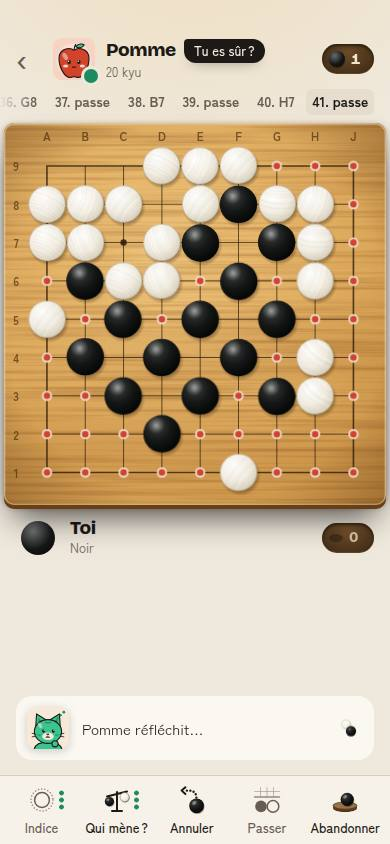 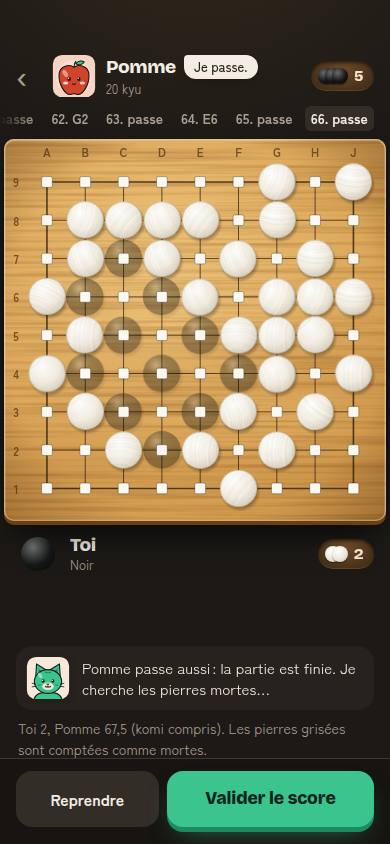 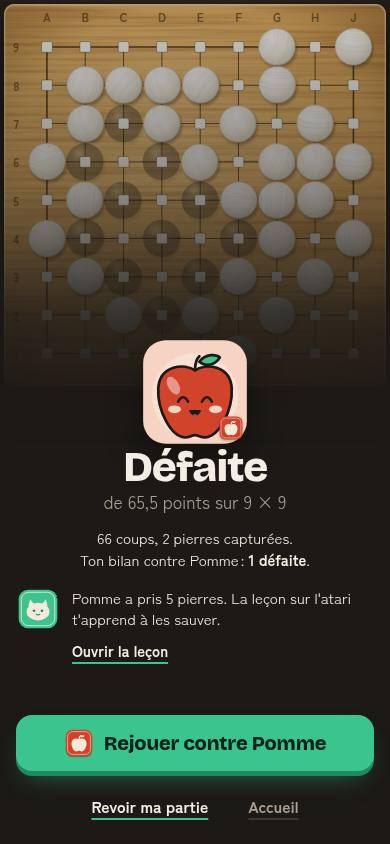

Le joueur passe au coup 32. Les points ouverts s'allument en rouge sur **tout** le plateau. Pomme « ferme une frontière » (E8, G8, F7…), puis une autre, et encore : 16 coups gratuits. Quand tout est fermé, les pierres noires sont encerclées : en sombre, Pomme prend 2 pierres et toutes les pierres noires sont grisées au comptage (« Toi 2, Pomme 67,5 »). Les deux parties finissent à **65,5 points**. Pomme dit « Déjà fini ? », « Tu es sûr ? » dans sa bulle pendant qu'elle joue chez toi.

Cause (lecture de `src/engine/simple.ts`, l. 250-256) : dans les parties « accommodantes », Pomme passe quand tu passes **sauf s'il reste une frontière ouverte**, qu'elle ferme d'abord. Quand le débutant passe tôt, tout est frontière : l'exception devient la règle. Le komi 0,5 (#160) ne sert à rien si la partie se joue ensuite sans lui.

La revue le dit honnêtement : « Ici, tu as passé trop tôt… environ 55 points perdus. » C'est juste. Mais pendant la partie, rien n'a dit au joueur de répondre. Le message ne décrit que Pomme.

*Comparaison* : **Clash Royale** garantit la victoire des combats du camp d'entraînement. **Candy Crush** rend ses premiers niveaux gagnables par accident. Chez **OGS**, on est prévenu **avant** le comptage qu'il reste des points à fermer, et la partie ne continue pas toute seule (base de connaissances, « Boucle de jeu »).

### N2. Trois fêtes en même temps, qui cachent la consigne

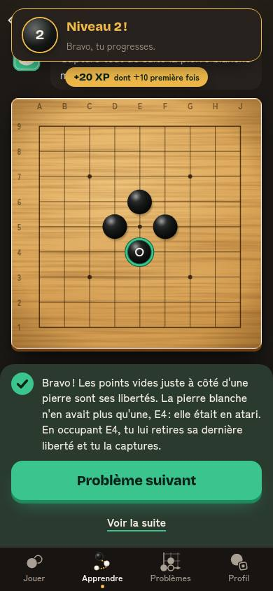

Au premier problème d'entraînement, trois choses arrivent ensemble : le bandeau « Niveau 2 ! Bravo, tu progresses. » en haut, la pastille « +20 XP dont +10 première fois » juste dessous, et la feuille « Bravo ! Les points vides… » (4 lignes) en bas. Le bandeau et la pastille couvrent le titre et la consigne du problème. Le passage au niveau 2, le vrai jalon de la session, se perd au milieu d'un exercice.

Compte de la session (10 minutes) : 6 gains d'XP annoncés (fin de partie, fin de leçon, 3 problèmes, Go du jour), 1 fête de niveau, 1 sceau de leçon, jusqu'à 2 « Bravo, tu captures » en partie, 5 feuilles de réussite. Chaque fête est bien faite ; ensemble, elles se marchent dessus.

*Comparaison* : **Duolingo** met les récompenses **après** la leçon, une par écran, dans l'ordre (XP, puis série, puis ligue) ; jamais au milieu d'un exercice. **Candy Crush** garde toutes ses fêtes pour la fin du niveau (« Sugar Crush »).

### N3. Le même exercice quatre fois

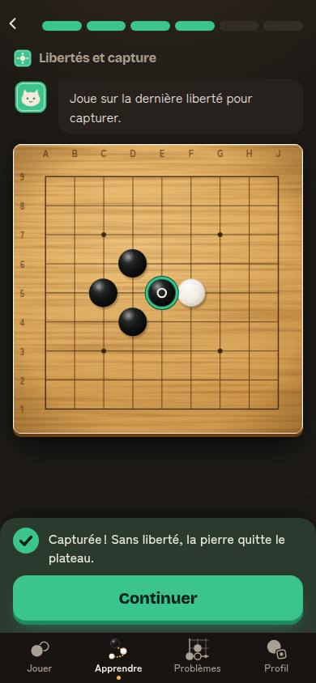 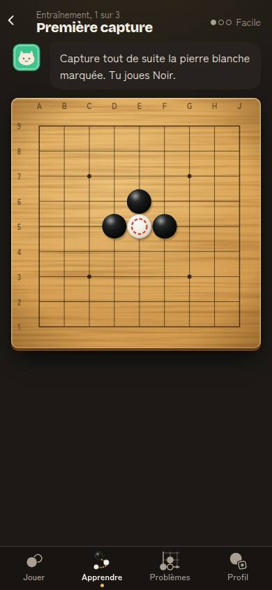 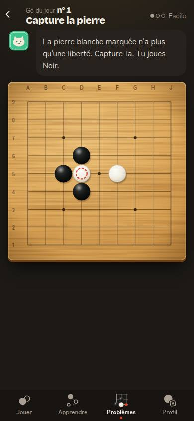 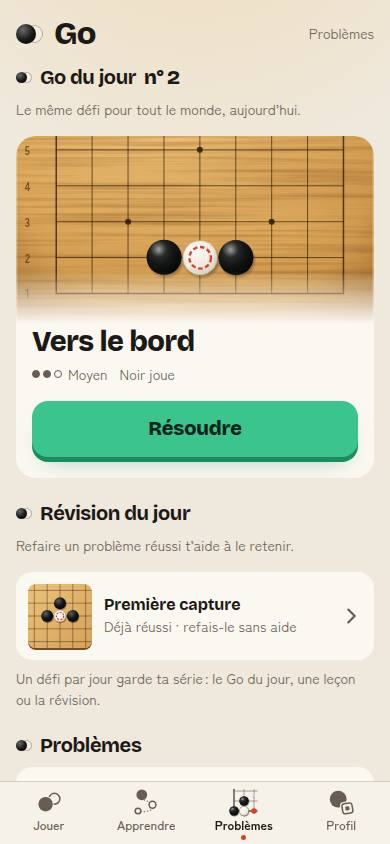

Leçon 1 (étape 4) : capture d'une pierre sur sa dernière liberté. Pratique 1 « Première capture » : la même forme. Go du jour n° 1 « Capture la pierre » : encore la même. J1, « Révision du jour » : « Première capture », encore. Chacune de ces fonctions est bonne seule. Ensemble, le débutant fait quatre fois la même chose, et le Go du jour « du monde entier » est pour lui une redite.

*Comparaison* : la répétition espacée de **Duolingo** varie la forme de l'exercice (traduire, écouter, compléter) sur la même notion. Le « Go du jour » gagne à être **différent** de ce qu'on vient de faire.

### N4. L'accueil de J1 propose deux choses

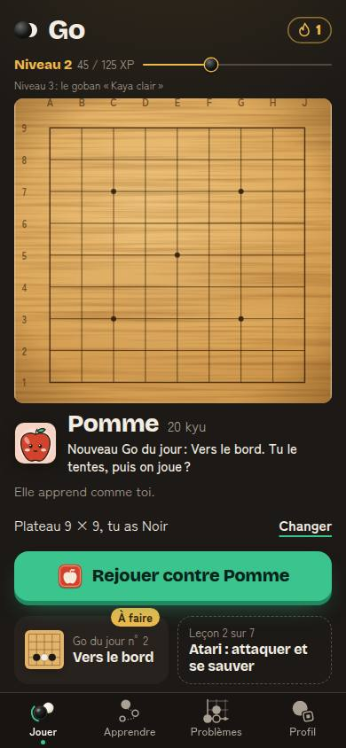 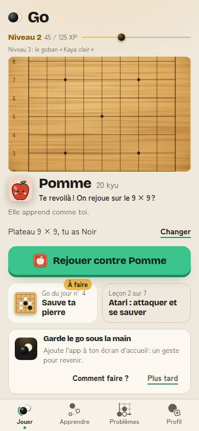

Pomme dit « Nouveau Go du jour : Vers le bord. Tu le tentes, puis on joue ? ». Le gros bouton dit « Rejouer contre Pomme ». La pastille or « À faire » est sur la tuile du Go du jour. Le joueur lit une chose et on lui montre l'autre. À J3, s'ajoute la carte d'installation : trois appels sur un écran, et le plateau d'accueil est coupé en haut et en bas pour faire de la place.

Dès le premier lancement, la tuile du Go du jour porte déjà « À faire » en or, à côté de « Joue ta première partie » : deux appels avant même la première pierre.

*Comparaison* : **chess.com** : un bouton « Jouer » en relief, le problème du jour dans une carte en dessous, sans pastille. **Duolingo** : un seul bouton « Commencer » sur la prochaine leçon ; la série est dans l'en-tête.

### N5. Le vocabulaire de la boucle quotidienne se disperse

Sur une session et un retour, on lit : « Go du jour », « défi », « Révision du jour », « Un défi par jour garde ta série », « 1 jour de suite », « 1 jour de record », la flamme seule, « À faire », « Fait », « Réussi ». Le mot « Continuer » veut dire quatre choses : l'étape suivante d'une leçon, la leçon suivante sur le chemin, le problème suivant (« Continuer · Le plus gros d'abord ») et la fin du récit du score. En partie, Pomme dit encore « Tu es sûr ? » et « Déjà fini ? » pendant qu'elle joue chez toi (ton déjà signalé comme moqueur). La revue finit par « Pour voir le meilleur coup, joue contre Bambou ou plus fort » : le débutant ne connaît pas Bambou. « 1 jour de record » dans le Profil, le premier jour, n'a pas de sens.

*Comparaison* : **Duolingo** a un mot par objet (« série », « XP », « leçon ») et le garde partout. **chess.com** dit toujours « Puzzle of the Day » et « streak ».

### N6. L'erreur ne se corrige pas pareil partout

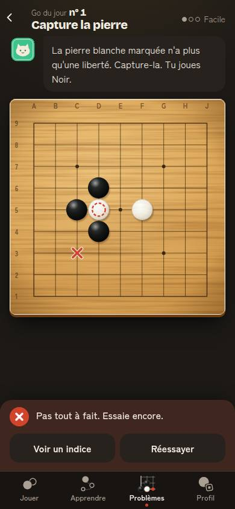 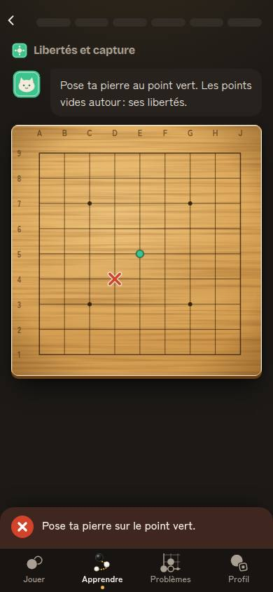

Dans la leçon (#198), l'erreur se corrige sans bouton : on rejoue. Dans le Go du jour, la feuille rouge montre deux boutons de même poids, « Voir un indice » et « Réessayer ». Le plateau accepte pourtant le coup suivant sans toucher « Réessayer » (vérifié : le 2e essai s'est joué directement). Après deux erreurs, rien ne change : l'indice attend qu'on le demande. La réussite du Go du jour dit seulement « Bravo, c'est le bon coup ! », alors que les problèmes d'entraînement expliquent en 4 lignes.

### N7. La partie montre cinq outils au débutant

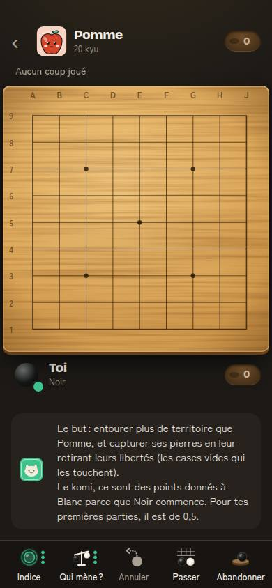

En bas de la première partie : « Indice » (avec 3 points), « Qui mène ? » (avec 3 points), « Annuler », « Passer », « Abandonner ». Cinq boutons de même poids. Le débutant a besoin de deux choses : poser une pierre et savoir quand finir. « Passer » est l'action qui décide de la partie (N1), et elle a le même poids que « Qui mène ? ».

---

## Nouveaux constats classés

Impact sur les indicateurs de `entreprise/charte.md` ; effort : S (moins d'un jour), M (2 à 4 jours), L (plus). Ordre : impact / effort.

| # | Constat | Impact | Effort | Proposition concrète | Indicateur qui doit bouger |
|---|---|---|---|---|---|
| **N1** | 1re partie perdue de 65 points : Pomme joue 16 coups pendant les passes | **Très fort** (J1, parties terminées, note) | S | **Dans les 3 parties du camp, Pomme passe quand tu passes, point.** Si des frontières sont ouvertes, Mochi le dit **avant** : au 1er toucher de « Passer », « Il reste des points à personne (en rouge). Tu peux les fermer, ou passer quand même. » avec « Passer quand même » en second bouton. Retirer « Tu es sûr ? » et « Déjà fini ? » quand Pomme ne passe pas. Test e2e : le débutant scripté du 27/09 finit en ≤ 2 passes et perd de moins de 15 points. | passes par partie (médiane ≤ 2, `passe_joueur`) ; part des 1res parties gagnées ; écart moyen de la 1re partie ; J1 |
| **N2** | Niveau 2, « +XP » et « Bravo » en même temps, sur la consigne | Fort (pic de la session, J1) | S | **Une fête à la fois, jamais sur la consigne.** File d'attente : la pastille XP et le bandeau de niveau attendent la fin de l'exercice (feuille de réussite fermée ou écran de fin). Le niveau a son moment à lui : sur la fin de série d'entraînement ou l'accueil suivant, « Niveau 2 ! » en grand, une seconde. | part des sessions où le niveau 2 est vu (`niveau_atteint` avec `ecran`) ; réussite du problème affiché pendant la fête |
| **N4** | Accueil J1 : la bulle propose le Go du jour, le bouton propose la partie ; « À faire » dès le 1er lancement | Fort (3 secondes, J1) | S | **La bulle et le bouton disent la même chose.** Premier lancement : pas de pastille « À faire » (elle apparaît après la première partie). Retour du jour : si Pomme parle du Go du jour, le bouton devient « Go du jour : Vers le bord » et la partie passe en tuile ; sinon la bulle parle de la partie. Carte d'installation : seulement si aucun autre appel n'est à l'écran. | taux de clic de l'action principale de l'accueil ; part des retours J1 avec Go du jour fait ; `installation_acceptee` |
| **N3** | La même capture 4 fois (leçon, pratique, Go du jour, révision) | Moyen (plaisir, J1-J7) | S | Le Go du jour d'un joueur de moins de 7 jours ne reprend pas une position déjà vue ce jour-là : on prend le suivant de la piste Débutant (propose aussi C14). La révision du lendemain choisit un problème **pas** vu la veille en pratique. Si c'est la même forme, le dire : « Tu l'as vue en leçon. Cette fois, sans aide ! » | réussite du Go du jour au 1er essai, J1 à J7 ; `go_du_jour_resolu` à J1 |
| **N6** | Problèmes : deux boutons après l'erreur ; réussite du Go du jour sans explication | Moyen (apprentissage, charte point 3) | S | Même règle que la leçon : pas de « Réessayer », on rejoue sur le plateau ; au 2e échec, l'indice s'allume tout seul. Écrire `explanation` pour les 6 problèmes de base (le n° 1 est vu par tous les nouveaux). | réussite au 2e essai ; `indice_vu` ; abandons de problème |
| **N5** | Vocabulaire dispersé (défi, série, record, jour de suite ; « Continuer » ×4 ; Bambou) | Moyen (compréhension, note) | S | Un lexique court dans `src/content/i18n` : « Go du jour », « série » (jamais « défi » à l'écran), « record » seulement à partir de 2 jours, « Continuer » réservé à « l'étape suivante » ; « Problème suivant » ailleurs. Revue : « Pour voir le meilleur coup, affronte un adversaire plus fort (à partir de Bambou, 3e de l'échelle). » | questions de support sur la série ; aucune (qualité) |
| **N7** | 5 outils de même poids en partie | Moyen (1re partie) | M | Dans les 3 parties du camp : « Passer » plus visible (à droite, libellé et icône pleins), « Abandonner » dans un menu « ⋯ », « Qui mène ? » masqué (comme la barre). | abandons en 1re partie ; passes par partie |

Les constats d'origine encore ouverts gardent leurs propositions : C1 (consentement après la première partie, P2 du 27/09), C4 (« Touche encore pour la poser », P3), C9 (« Défier Caillou » sur l'accueil après une victoire, P5), C14 (piste Débutant), B5/R4 (la série sur la feuille de réussite), partie C5 (alerte d'atari courte), partie C9 (récit : prisonniers et pierres mortes séparés), P2 (vitrine sur deux lignes).

## Les 5 nouveaux constats les plus forts

1. **N1 — La première partie se perd de 65 points** : dans le camp, Pomme ferme les frontières à chaque passe et joue 16 coups gratuits. Pomme doit passer quand tu passes, et Mochi prévenir **avant** la passe. Indicateur : passes par partie ≤ 2, part des 1res parties gagnées.
2. **N2 — Trois fêtes se marchent dessus** et cachent la consigne ; le niveau 2 se perd au milieu d'un exercice. Une fête à la fois, après l'exercice. Indicateur : niveau 2 vu.
3. **N4 — L'accueil dit deux choses** : la bulle propose le Go du jour, le bouton la partie ; « À faire » dès le premier lancement ; trois appels à J3. Indicateur : clic de l'action principale.
4. **N3 — La même capture quatre fois** en 24 heures (leçon, pratique, Go du jour, révision). Indicateur : réussite et envie de revenir à J1.
5. **N5 + N6 — Deux règles et deux vocabulaires** : l'erreur se corrige sans bouton en leçon, avec deux boutons en problème ; « défi », « série », « record », « jour de suite » pour la même flamme. Indicateur : réussite au 2e essai, retours joueurs.

## À vérifier avec de vrais joueurs

- Un vrai débutant qui lit « Pomme continue : il reste une frontière à fermer en E8 » rejoue-t-il, ou repasse-t-il ? (N1, le script repasse ; c'est l'hypothèse la plus prudente.)
- Le joueur voit-il le « Niveau 2 » au milieu du problème ? Sait-il le dire après la session ? (N2)
- À J1, que touche-t-il : ce que dit Pomme ou le bouton vert ? (N4)

## Sources

Déjà citées dans les analyses du 27 et du 28/09 et dans la base de connaissances : Clash Royale (camp d'entraînement), Candy Crush (premiers niveaux, Sugar Crush), OGS (avertissement avant le comptage), Duolingo (ordre des récompenses de fin de leçon, chemin, répétition espacée), chess.com (accueil, problème du jour, séries). Ajouts :

1. Duolingo, écrans de fin de leçon enchaînés un par un (XP, série, ligue) : [Appcues GoodUX, Duolingo](https://goodux.appcues.com/blog/duolingo-user-onboarding).
2. Loi de Hick (Hick 1952, Hyman 1953) : le temps de décision croît avec le nombre de choix : [Laws of UX, Hick's Law](https://lawsofux.com/hicks-law/).

## Hors périmètre

Aucun fichier de code modifié. Constats qui touchent d'autres agents : moteur de Pomme (`src/engine/simple.ts`, N1), partie (`src/app/Game.tsx`, N1, N7), annonces XP et niveau (`src/ui/PastilleXp.tsx`, `src/ui/Niveau.tsx`, N2), accueil (`src/app/home.ts`, N4), Go du jour et révision (`src/app/goDuJour.ts`, `src/app/revision.ts`, N3), Problèmes (`src/app/Puzzles.tsx`, N6), textes (`src/content/i18n/fr.ts`, N5). Les issues sont à créer par le dirigeant.
