# Le retour du joueur (J1, J3, J7, absence) et le Profil — 28 septembre 2026

Auteur : agent `ux-jeux-mobiles` (mission 4). Build : `main` à `81ac1d9`, `VITE_E2E=1 vite build`, `vite preview` sur le port 4671. Chromium de `/opt/pw-browsers`, 390 × 844, `fr-FR`, agent utilisateur Safari iPhone (pour voir la carte d'installation), mouvements réduits. Aucun code de l'app modifié.

## Méthode et limites

- Un script Playwright fige l'horloge et sème le `localStorage` d'un joueur sans compte. Il joue chaque scénario deux fois (sombre, clair) : 21 moments, 42 captures dans `captures/retour/`.
  - **J0** (28/09, semé) : une partie perdue contre Pomme, la leçon 1, le Go du jour n° 2 réussi. 115 XP, niveau 2, série 1, installation déjà proposée.
  - **J1** (29/09, 8 h 10) : arrivée, onglet Problèmes, Go du jour n° 3 résolu, retour à l'accueil, Profil. Variante : installation jamais proposée avant.
  - **J3** (30/09, 19 h 40) : arrivée, Go du jour n° 4, invitation au compte (Problèmes, Profil), page « Mon compte ».
  - **J7** (04/10, 9 h 05) : 6 parties, Pomme battue une fois, 3 leçons, 10 problèmes, 420 XP (niveau 4). Go du jour n° 8 : série 7, gel gagné.
  - **Un jour manqué** (06/10) : le gel sauve la série.
  - **Trois jours d'absence** (08/10, 18 h 20) : série de 7 perdue, 1 gel en réserve. Accueil, Problèmes, Profil, Go du jour n° 12.
- Mesures dans la page : cibles de moins de 44 px, mots visibles, hauteur de page.
- Lecture du code : `src/app/App.tsx`, `Accueil.tsx`, `home.ts`, `goDuJour.ts`, `gel.ts`, `gelAppareil.ts`, `serieLocale.ts`, `xp.ts`, `installation.ts`, `Profil.tsx`, `vitrine.ts`, `identite.ts`, `Account.tsx`, `src/ui/Vitrine.tsx`, `ProposerInstallation.tsx`, `src/data/analytics.ts`, migration `20260928010000_importer_serie_appareil.sql`.
- Limites : pas de vrai joueur ; Chromium n'est pas Safari (la carte iPhone est vue, l'installation n'est pas faite) ; le build local n'a pas de clés Supabase, donc la page « Mon compte » affiche « connexion pas disponible » (formulaire lu dans le code). Les états sont semés : les XP gagnés à J7 dans le script ne sont pas ceux d'un vrai joueur.

## Les chiffres

| Mesure | Valeur |
|---|---|
| Cibles de moins de 44 px (accueil, Go du jour réussi, carte d'installation, Profil, Mon compte, J1 à absence) | **0** |
| Textes de l'accueil qui changent entre J1, J3, J7 et le retour après absence | **0** (bulle « Te revoilà ! On rejoue sur le 9 × 9 ? » les 4 fois) |
| Écrans de réussite du Go du jour qui disent la série (J1, J3, J7, retour) | **0 sur 4** |
| Badge « 7 jours de série » après 3 jours d'absence | **retiré** de la vitrine |
| Record de série gardé quelque part | **non** (`go.go-du-jour.v1` ne garde que `{ dernier, jours }`) |
| Lignes de réglages dans le Profil | 6 sur 8 lignes (le reste : compte, conditions) |
| Niveau et XP visibles dans le Profil | **non** (seulement sur l'accueil) |
| Mots visibles : accueil 76 à 81 ; Profil 90 à 101 ; Problèmes **700** (17 000 px) | |
| Notifications ou rappels | aucun (pas de code de notification) |

---

## 1. J1 : le lendemain

 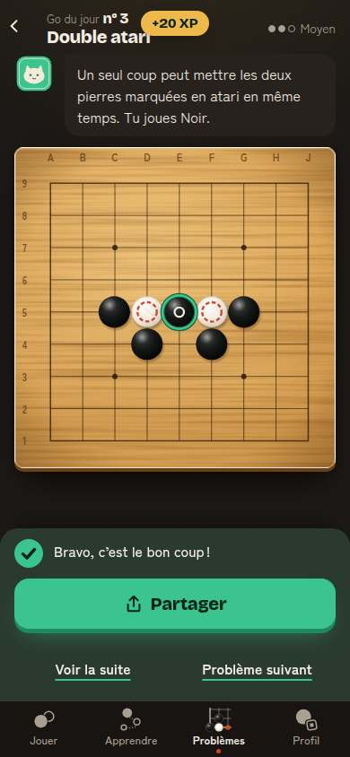 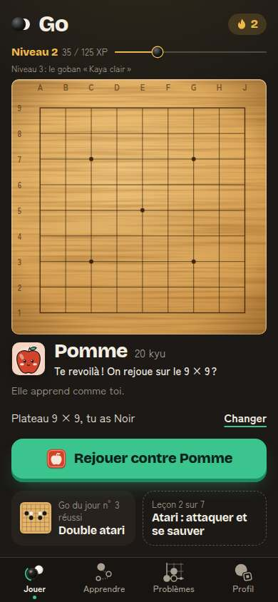

Ce qui marche : on comprend l'accueil en 3 secondes. Un bouton (« Rejouer contre Pomme »), la barre de niveau (« Niveau 2 · 15 / 125 XP », « Niveau 3 : le goban Kaya clair »), la flamme en haut à droite. Pomme dit « Te revoilà ! ». Le Go du jour se résout en 3 taps depuis l'accueil (tuile, « Résoudre », la pierre). « +20 XP » apparaît. La flamme passe de 1 à 2.

- **R2. Rien ne dit que la série est en jeu aujourd'hui.** À l'arrivée, la flamme montre « 1 », la même qu'après la réussite (« 2 » ensuite). Rien ne distingue « à faire » de « fait ». La tuile du Go du jour est petite, en bas, à côté de la leçon ; « réussi » s'écrit en petit gris. *Comparaison* : chez **Duolingo**, la flamme reste grise tant que la leçon du jour n'est pas faite, puis s'allume avec une animation ([Duolingo Wiki, Streak](https://duolingo.fandom.com/wiki/Streak)). Chez **chess.com**, la flamme est à côté du pseudo sur l'accueil ; un widget dit si elle est active aujourd'hui ([chess.com Help, What are Streaks?](https://support.chess.com/en/articles/9714718-what-are-streaks)).
- **R4. La réussite ne parle pas de la série.** La feuille dit « Bravo, c'est le bon coup ! » puis « Partager ». Elle ne dit pas « 2 jours de suite », ni « À demain : Go du jour n° 4 ». La série n'apparaît qu'en revenant à l'accueil. Déjà noté le 28/09 (B5) ; toujours vrai aux 4 retours testés. *Comparaison* : **Wordle** ouvre ses statistiques dès la fin : parties, % de victoires, série en cours, **meilleure série**, répartition des essais ([Nerds Chalk, Wordle stats](https://nerdschalk.com/average-wordle-score-and-stats-what-are-they-and-how-to-find-some/)). Chez **Duolingo**, un écran de série suit chaque première leçon du jour. Une animation plus forte aux jalons a fait monter la rétention à 7 jours des nouveaux de **+1,7 %** en test A/B ([blog Duolingo, Animating the Streak](https://blog.duolingo.com/streak-milestone-design-animation/)).
- **R7. Le « +20 XP » couvre le titre du problème** (« Double atari » est coupé par la pastille, captures 03 et 08). Déjà noté (B5).

## 2. L'installation

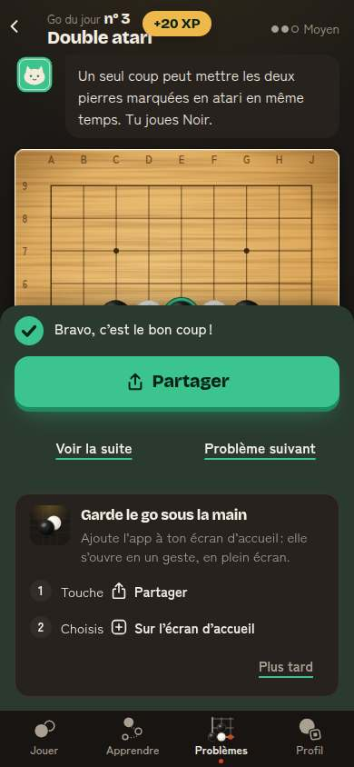

La carte « Garde le go sous la main » est bien écrite (deux étapes, « Plus tard »). Mais :

- **R5a. Elle arrive par-dessus la réussite.** Sous la feuille de réussite, elle cache le plateau et la pierre qu'on vient de poser. Il y a deux « Partager » à l'écran : le bouton vert (partager son résultat) et l'étape 1 (le bouton Partager de Safari). Un débutant peut toucher le vert en croyant installer.
- **R5b. Elle ne revient jamais.** Une fois montrée, même sans réponse, elle ne revient pas (`doitProposer` : `etat !== null`). Elle n'existe nulle part ailleurs : aucune ligne « Installer l'app » dans le Profil. Or sur iPhone, pas d'app installée veut dire pas de rappel possible ([WebKit, Web Push](https://webkit.org/blog/13878/web-push-for-web-apps-on-ios-and-ipados/), déjà dans la base).
- *Comparaison* : **chess.com** propose un widget d'écran d'accueil qui montre si la série du jour est active ([chess.com, widget](https://www.chess.com/news/view/announcing-chesscom-widget)). **Duolingo** fait de même avec un widget (la hausse de 60 % souvent citée vient de sources secondaires, non vérifiée).

## 3. J3 : l'invitation au compte

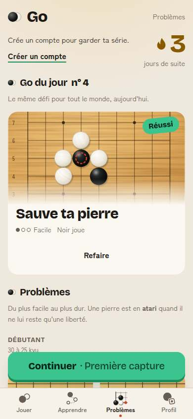 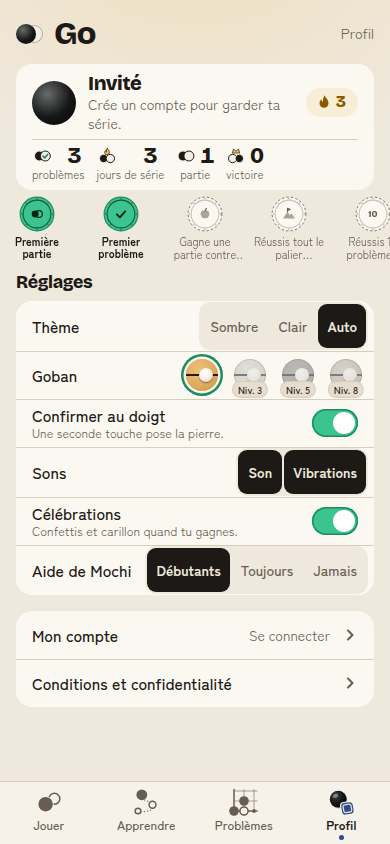 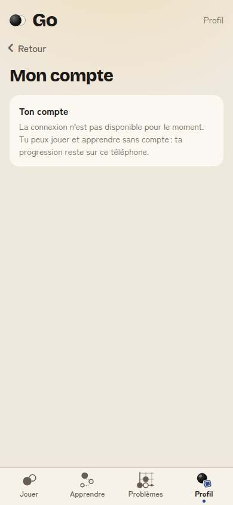

Ce qui marche : l'invitation est discrète et arrive après 3 jours, pas au premier lancement. Elle remplace une ligne existante : pas de fenêtre, pas de blocage. Depuis #176, la série de l'appareil est bien envoyée au serveur à la connexion (`importer_serie_appareil`).

- **R6. La promesse n'est pas la même selon l'écran, et elle est incomplète.** Problèmes et Profil disent « Crée un compte pour garder ta série ». La page du compte dit « Garde ta cote et joue en ligne ». Or les XP, le niveau, les gobans débloqués, les badges et les gels restent sur le téléphone (`go.xp.v1`, `go.gel.v1`, vitrine calculée en local). Un joueur qui change de téléphone perd son niveau 4. La charte (point 4) ne veut aucune approximation.
- *Comparaison* : **Duolingo** demande le compte après la première leçon, en disant ce qu'on garde (« Crée un profil pour sauvegarder tes progrès »), déjà dans la base. **chess.com** ne laisse presque rien faire sans compte : ce n'est pas notre modèle.

## 4. J7 : la semaine

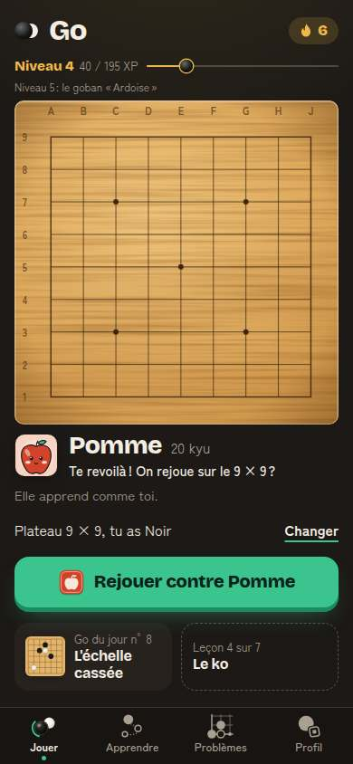 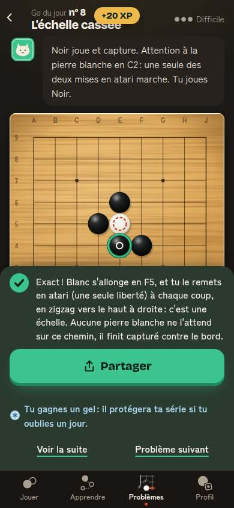 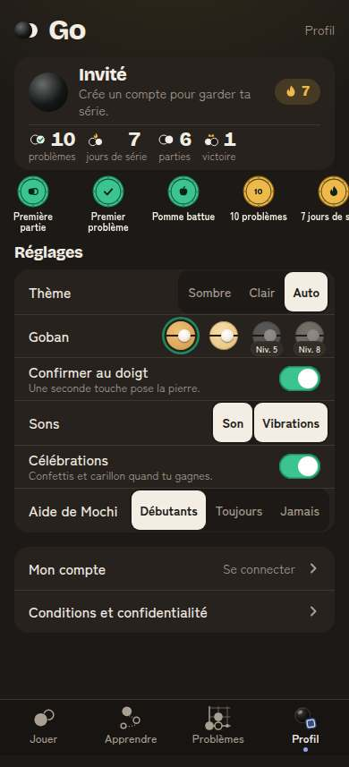

Ce qui marche : l'explication du problème est bonne (« c'est une échelle… »). Le gel est gagné et dit simplement (« Tu gagnes un gel : il protégera ta série si tu oublies un jour »). Il se voit ensuite à côté de la flamme (« 7 » et « ❄ 1 »). Le badge « 7 jours de série » s'allume, en or.

- **R4 (suite). Le 7e jour n'est pas fêté.** C'est le premier vrai jalon, et le seul badge de série. Pas de confettis, pas de phrase, pas de « 7 » en grand. La feuille parle du gel, pas de la semaine. Le badge s'allume sans bruit dans le Profil.
- **R8. Le Go du jour du 7e jour est « Difficile »** (c2, difficulté 850) pour un joueur de 20 kyu. Voir B4 du 28/09 (piste Débutant). Un échec ce jour-là ne casse pas la série (on peut réessayer), mais il gâche le jalon.
- **R9. Les récompenses ne se voient pas.** Au niveau 4, le goban « Kaya clair » est débloqué depuis le niveau 3. Pourtant, rien ne le dit ailleurs que dans une pastille de 44 px du Profil, sans marque « nouveau ». L'accueil annonce déjà la suivante (« Niveau 5 : le goban Ardoise »). La fête du niveau existe (`FeteNiveau`), mais le joueur qui l'a ratée n'a pas de rappel.

## 5. Un jour manqué : le gel

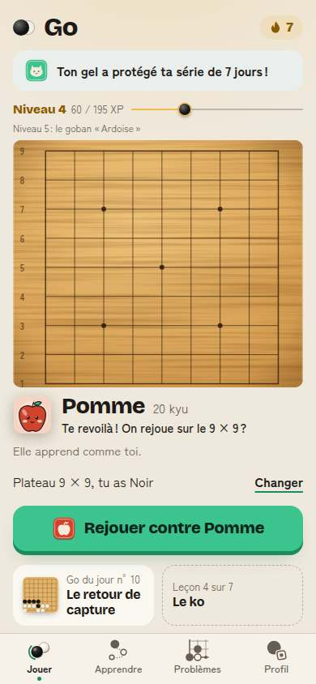

Très bien : Mochi dit « Ton gel a protégé ta série de 7 jours ! », une seule fois. Le gel n'est pas brûlé pour rien si l'absence est trop longue. C'est le modèle Duolingo, avec le même plafond de 2 gels ([Duolingo Wiki, Streak freeze](https://duolingo.fandom.com/wiki/Shop/Streak_freeze)), mais **sans achat** : bien. Petit défaut : la bulle pousse le plateau de 60 px vers le bas (voir l'entrée CLS de la base).

## 6. Après 3 jours d'absence : la série perdue

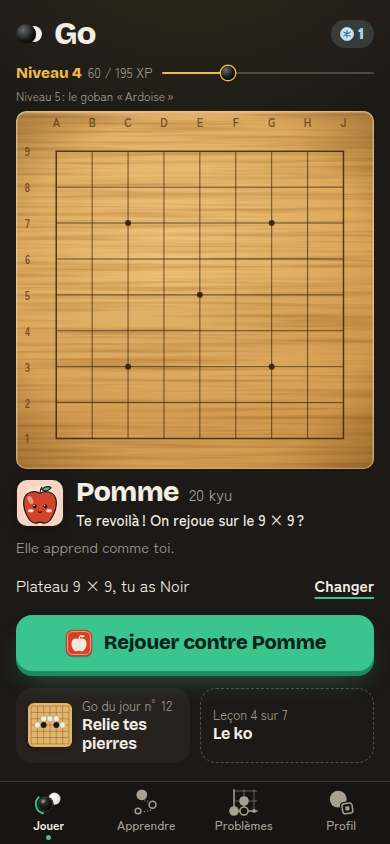 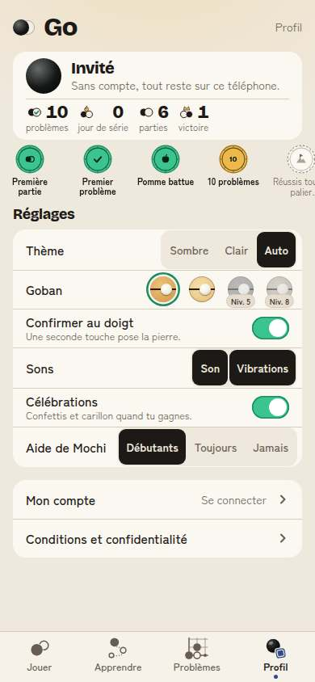 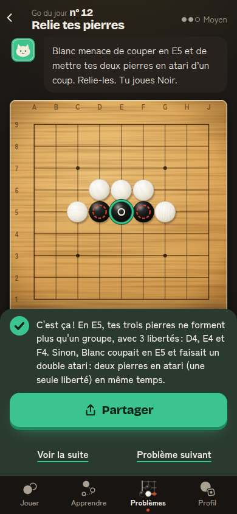

C'est le moment le plus fragile du parcours, et il est traité **en silence**.

- **R1. La série disparaît sans un mot, et le badge avec.** Sur l'accueil, la flamme a disparu ; il reste une pierre givrée « 1 » seule, sans explication. Le Profil affiche « **0 jour de série** ». Le badge « 7 jours de série » **n'est plus dans la vitrine** : il se calcule sur la série en cours (`obtenu: d.serie >= 7`, `src/app/vitrine.ts`). Le record de 7 jours n'est gardé nulle part. Pomme dit « Te revoilà ! On rejoue sur le 9 × 9 ? », comme la veille. Retirer un badge gagné est une **perte punitive**, contraire à nos règles et à `xp.ts` (« on ne perd jamais »).
- **R3. Deux jours manqués avec un seul gel : tout est perdu.** Aucune voie de retour, aucune demande d'effort pour réparer.
- *Comparaison* :
  - **Duolingo** a constaté que beaucoup de joueurs qui perdent une longue série ne reviennent pas : ils avaient manqué un jour (voyage, maladie), et repartir de zéro leur semblait vain. En juin 2026, il a permis de **regagner** une série perdue de 30 jours ou plus en faisant 3 leçons d'affilée : 15,4 millions de séries ravivées ([ContentGrip](https://www.contentgrip.com/duolingo-streak-revival-campaign/), [Fast Company](https://www.fastcompany.com/91551760/heres-how-to-restore-your-long-dead-duolingo-streak)). Le « record » (plus longue série) reste dans le Profil, parmi les records personnels ([Duolingo Wiki, Achievements](https://duolingo.fandom.com/wiki/Achievements)).
  - **chess.com** compte n'importe quelle activité (partie, leçon, problème, revue). La série ne tombe qu'après **3 jours** sans rien (2 jours de grâce). On peut la masquer dans les réglages ([chess.com Help](https://support.chess.com/en/articles/9714718-what-are-streaks)).
  - **Wordle** remet la série à zéro, mais garde « Max Streak » à côté, pour toujours.
  - **À ne pas copier** : les rappels de Duolingo qui culpabilisent (« Tu as rendu Duo triste »). Duolingo arrête lui-même ses rappels après une semaine sans réponse ([Medium, Debugger](https://debugger.medium.com/duolingo-needs-to-chill-8f1832745ca0)).
  - **Clash Royale**, contre-exemple devenu exemple : les coffres à minuteur et à file d'attente (4 places, des heures d'attente, des gemmes pour accélérer) donnaient une raison de revenir fondée sur l'attente. Ils ont été supprimés en mars 2025 au profit de récompenses immédiates après chaque combat ([RoyaleAPI, RIP Chests](https://royaleapi.com/blog/rip-chests-2025-q1-update?lang=en), [Clash Royale Wiki, Chests](https://clashroyale.fandom.com/wiki/Chests)). **À ne pas copier** : le minuteur et l'accélération payante. Leçon : la raison de revenir doit être l'envie de jouer, pas une horloge.

## 7. Le Profil

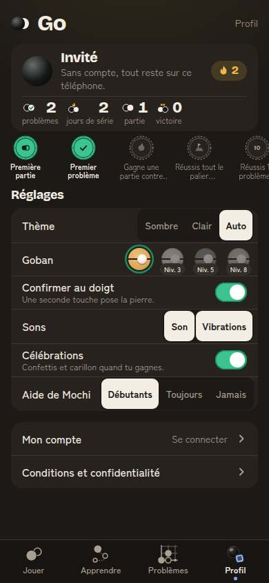 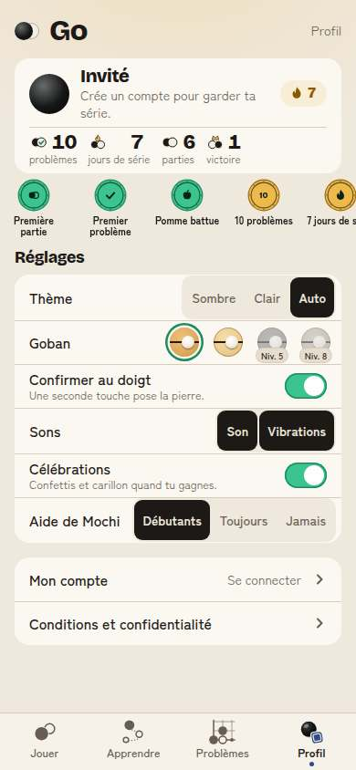

Ce qui marche : tout tient sans défiler (857 px). Carte d'identité claire (« Invité », « Sans compte, tout reste sur ce téléphone »). Quatre chiffres avec icônes aux deux pierres. Sceaux jade et or, beaux dans les deux thèmes. Réglages en lignes, toutes à 44 px ou plus. Les gobans à venir se voient avec leur niveau : on donne envie sans rien cacher.

- **P1. Le Profil est surtout une page de réglages.** 6 lignes sur 8 sont des réglages (thème, goban, confirmation, sons, célébrations, aide de Mochi). Le niveau, les XP, le record, les leçons faites, les adversaires battus n'y sont pas. La série y est deux fois (pastille « 🔥 2 » et chiffre « 2 jours de série »). *Comparaison* : **chess.com** sépare le profil (cotes, **meilleure cote avec sa date**, séries de victoires, graphiques) des réglages (roue dentée) ([chess.com Help, Ratings & Stats](https://support.chess.com/en/collections/13178555-ratings-stats)). **Duolingo** montre sur le profil la série, les XP totaux, la ligue et les « records personnels » (plus longue série, meilleur jour d'XP).
- **P2. La vitrine coupe ses textes.** La rangée défile de côté sans rien qui l'indique. Les conditions sont tronquées (« Gagne une partie contre… », « Réussis tout le palier… », « 7 jours de s… »). Les badges ne se touchent pas : impossible de lire la condition entière au doigt. Le nom accessible est complet, mais il est posé sur un `li` sans rôle ; il n'est pas lu partout.
- **P3. « Aide de Mochi : Débutants / Toujours / Jamais »** se comprend mal sans l'aide (« Débutants » = contre Pomme et Caillou). *Hypothèse* : « Mochi te conseille : contre les premiers adversaires / toujours / jamais ».

## 8. Accessibilité

- 0 cible de moins de 44 px sur les 12 écrans mesurés. Contraste lisible dans les deux thèmes (la pierre givrée claire sur fond clair reste lisible grâce à son contour).
- Mouvements réduits : respectés (captures faites ainsi, aucune animation bloquante).
- Lecteur d'écran : la flamme a un nom (« 2 jours de série »), le glaçon aussi (« 1 gel de série en réserve »). Mais seul, après une série perdue, le glaçon ne dit pas pourquoi la flamme a disparu (R1). La vitrine : voir P2.

## 9. Mesurer le retour

- **M1. La rétention J1 / J7 ne se mesure pas pour les joueurs sans consentement.** La mesure anonyme n'écrit rien sur l'appareil (`persistence: 'memory'`, `person_profiles: 'never'`). Chaque ouverture est un inconnu, et `app_ouverte` n'a que `installee`. Or la charte suit J1, J7 et J30 chaque semaine. Hypothèse à faire valider par l'agent juridique : ajouter à `app_ouverte` des propriétés **déduites des données de jeu déjà sur l'appareil**, en tranches. Par exemple `serie` (0, 1, 2-6, 7+) et `jours_depuis_premiere_partie` (0, 1, 2-6, 7-29, 30+), sans identifiant. On aurait ainsi une rétention approchée sans suivre personne.

---

## Constats classés

Impact sur les indicateurs de `entreprise/charte.md` ; effort : S (moins d'un jour), M (2 à 4 jours), L (plus).

| # | Constat | Impact | Effort | Proposition | Indicateur qui doit bouger |
|---|---|---|---|---|---|
| **R1** | Série perdue sans un mot ; badge « 7 jours » retiré ; record effacé ; « 0 jour de série » | **Fort** (J30, note des stores) | S | **Rien de gagné ne se perd.** Garder `record` à côté de la série. Badge de série = record ≥ 7, plus jamais retiré. Au retour, Mochi, une fois : « Ta série de 7 jours est dans ton record. On en commence une nouvelle ? ». Profil : « Record : 7 jours » à la place de « 0 jour de série ». Pas de « 0 » en gros, pas de flamme éteinte mise en avant. | retour à J+7 des joueurs qui ont perdu une série ≥ 3 (événement `serie_perdue` à créer, avec `jours`) ; avis qui parlent de série |
| **R2** | Accueil identique chaque jour ; rien ne dit que le Go du jour d'aujourd'hui est à faire | **Fort** (J1, J7) | S | **La flamme dit l'état du jour** : creuse (« à allumer ») tant que le Go du jour n'est pas fait, pleine après, avec un petit son et un halo (immobile en mouvements réduits). La bulle de Pomme change selon le jour : « Nouveau Go du jour : Double atari. Deux minutes ? » ; après une absence : « Content de te revoir ! On reprend en douceur ? ». Le bouton principal reste la partie. La tuile Go du jour porte « À faire » tant qu'il n'est pas fait. | part des jours actifs avec Go du jour réussi ; J1 ; J7 |
| **R4** | La réussite ne dit jamais la série ; le 7e jour n'est pas fêté | **Fort** (J7) | S | Sur la feuille de réussite : « 🔥 3 jours de suite » (la flamme monte d'un cran) et « À demain : Go du jour n° 5 ». Jalons 3, 7, 30 jours : grande flamme, carillon, confettis (réglage Célébrations), badge qui s'imprime. Une seule animation courte, jamais bloquante. Reprend B5 du 28/09. | J7 des nouveaux (Duolingo : +1,7 %) ; `go_du_jour_partage` au 7e jour |
| **R3** | Deux jours manqués avec un gel : tout est perdu, aucune voie de retour | **Fort** (J30) | M | **Réparer par l'effort, jamais par l'argent.** Dans les 7 jours qui suivent la perte : « Rattrape ta série : réussis le Go du jour 3 jours de suite, et elle revient. » Et/ou la série compte « un défi par jour » (Go du jour, leçon ou révision, A6 du 28/09) avec 1 jour de grâce comme chess.com. À tester en A/B contre l'état actuel. | J30 ; part des séries perdues puis réparées ; J7 |
| **R5** | Installation : carte sur la réussite, deux « Partager », une seule fois pour toujours | **Moyen à fort** (J7, J30 ; condition des rappels iPhone) | S | Montrer la carte **à l'accueil du 2e ou du 3e retour**, pas sur la feuille de réussite. Libellé de l'étape 1 : « Touche l'icône Partager de Safari ». Ajouter une ligne permanente « Installer l'app » dans le Profil (tant qu'elle n'est pas installée). Un seul nouvel essai si pas de réponse, jamais après « Plus tard ». | `installation_acceptee` ÷ joueurs actifs ; J7 des installés contre non installés |
| **P1** | Profil = réglages ; niveau, XP, record, leçons, adversaires absents | **Moyen** (J7, J30, conversion future « statistiques détaillées ») | M | Profil en deux parties : **« Ton parcours »** en haut (niveau et barre d'XP, record de série, leçons 3/7, adversaires battus sur 9, prochain goban à gagner) ; **Réglages** derrière une ligne (ou roue dentée), comme chess.com. Retirer la flamme en double. | visites du Profil par joueur actif ; J30 |
| **R6** | « Crée un compte pour garder ta série » : promesse partielle, XP et badges restent sur l'appareil | **Moyen** (confiance, inscriptions) | S | Texte vrai et identique partout : « Crée un compte : ta série et tes leçons te suivent sur tous tes appareils. » Puis synchroniser XP, badges et gels (issue à part), et seulement alors élargir la promesse. | `inscription` ÷ invitations vues (`invitation_compte_vue` à créer) |
| **M1** | J1 / J7 non mesurables sans consentement | **Moyen** (pilotage de tout le reste) | S | Propriétés en tranches sur `app_ouverte` (`serie`, `jours_depuis_premiere_partie`), déduites des données de jeu, **après avis juridique**. | disponibilité d'une courbe J1 / J7 approchée dans PostHog |
| **R9** | Récompenses débloquées invisibles hors du Profil | Faible à moyen (J7) | S | Point « nouveau » sur la pastille du goban débloqué, et une phrase sur l'accueil la première fois : « Nouveau goban débloqué : Kaya clair. Essaie-le ! » (lien vers le Profil). | part des joueurs de niveau 3 ou plus qui changent de goban |
| **P2** | Vitrine : textes coupés, défilement caché, badges non touchables | Faible (compréhension, accessibilité) | S | Badges sur 2 lignes en grille (7 badges tiennent) ; toucher un badge ouvre sa condition entière ; rôle `img` ou bouton avec nom. | aucun indicateur direct ; audit lecteur d'écran |
| **R8** | Go du jour « Difficile » au 7e jour d'un débutant | Faible à moyen (J7) | S | Piste Débutant les 7 premiers jours (B4 du 28/09). | réussite au 1er essai des jours 2 à 7 |
| **R7** | « +20 XP » couvre le titre du problème | Faible | S | Pastille sous l'en-tête (B5 du 28/09). | — |
| **P3** | « Aide de Mochi : Débutants » peu clair | Faible | S | « Mochi te conseille : contre les premiers adversaires / toujours / jamais ». | — |

### Rappels quotidiens (plus tard, après l'installation)

Pas de rappel aujourd'hui, et c'est mieux qu'un mauvais rappel. Quand ils viendront (Capacitor, ou PWA installée) :
- ils sont demandés **après** un geste, au moment fort (J3, série de 3), jamais au lancement ;
- ils partent à l'heure où le joueur joue d'habitude. *Prouvé* : les indices liés à un moment de la journée ancrent mieux l'habitude que les rappels seuls (Stawarz et al., CHI 2015, dans la base) ;
- le texte change chaque jour et parle du jeu (« Nouveau Go du jour : Le filet ») ; jamais de culpabilité (« Mochi est triste ») ni de fausse urgence (« Plus que 2 h ! ») ;
- ils s'arrêtent seuls après 7 jours sans réponse, en le disant une fois, gentiment.

## Les 5 propositions les plus fortes

1. **R1, rien de gagné ne se perd** (S) : record de série gardé, badge « 7 jours » jamais retiré, Mochi accueille le retour sans punir. Indicateur : retour à J+7 après une série perdue.
2. **R2, la flamme dit l'état du jour** (S) : creuse puis pleine ; bulle de Pomme qui change selon le jour et après une absence ; tuile « À faire ». Indicateur : jours actifs avec Go du jour, J1.
3. **R4, fêter la série au bon moment** (S) : « 3 jours de suite, à demain » sur la réussite, vrai moment aux jalons 3 et 7. Indicateur : J7 des nouveaux.
4. **R3, réparer la série par l'effort** (M) : rattrapage en 3 Go du jour d'affilée, ou série « un défi par jour » avec un jour de grâce. Indicateur : J30, séries réparées.
5. **R5 + P1, installation au bon endroit et Profil « Ton parcours »** (S + M) : installation proposée à l'accueil d'un retour et disponible dans le Profil ; Profil qui montre la progression avant les réglages. Indicateurs : taux d'installation, J30.

## Sources

1. Duolingo, série et gels : [Duolingo Wiki, Streak](https://duolingo.fandom.com/wiki/Streak), [Streak freeze](https://duolingo.fandom.com/wiki/Shop/Streak_freeze), [Achievements](https://duolingo.fandom.com/wiki/Achievements).
2. Duolingo, animation des jalons (+1,7 % à J7) : [blog Duolingo](https://blog.duolingo.com/streak-milestone-design-animation/).
3. Duolingo, séries ravivées (juin 2026) : [ContentGrip](https://www.contentgrip.com/duolingo-streak-revival-campaign/), [Fast Company](https://www.fastcompany.com/91551760/heres-how-to-restore-your-long-dead-duolingo-streak), [Android Authority](https://www.androidauthority.com/duolingo-revive-broken-streak-event-3673004/).
4. Duolingo, rappels culpabilisants : [Medium, Debugger](https://debugger.medium.com/duolingo-needs-to-chill-8f1832745ca0).
5. chess.com, séries (toute activité, 2 jours de grâce, masquables) : [aide chess.com](https://support.chess.com/en/articles/9714718-what-are-streaks) ; widget : [chess.com News](https://www.chess.com/news/view/announcing-chesscom-widget) ; statistiques : [aide chess.com](https://support.chess.com/en/collections/13178555-ratings-stats).
6. Wordle, statistiques et meilleure série : [Nerds Chalk](https://nerdschalk.com/average-wordle-score-and-stats-what-are-they-and-how-to-find-some/).
7. Clash Royale, fin des coffres à minuteur (2025) : [RoyaleAPI](https://royaleapi.com/blog/rip-chests-2025-q1-update?lang=en), [Clash Royale Wiki](https://clashroyale.fandom.com/wiki/Chests).
8. BadukPop, problèmes quotidiens et classement entre amis : [site BadukPop](https://badukpop.com/), [App Store](https://apps.apple.com/us/app/badukpop-go/id1472684271).
9. Recherche : Lally et al. 2010 ; Dai, Milkman et Riis 2014 ; Stawarz, Cox et Blandford 2015 ; Kivetz, Urminsky et Zheng 2006 (voir la base de connaissances).
